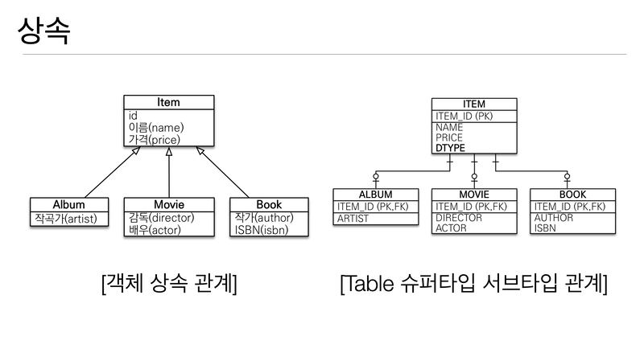
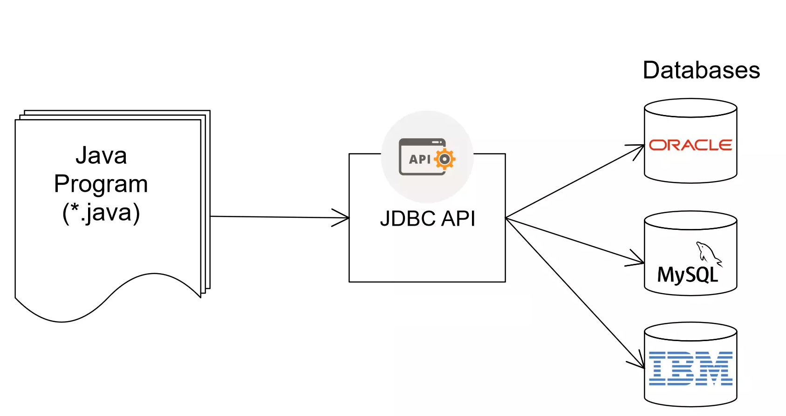
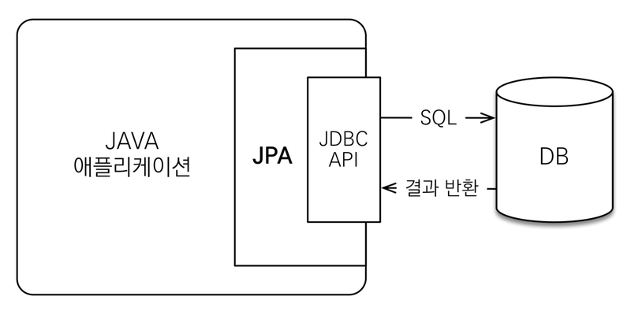

<!-- TOC -->
* [Ch01. 패러다임의 불일치 및 JPA를 사용하는 이유](#ch01-패러다임의-불일치-및-jpa를-사용하는-이유)
  * [1. SQL 중심적인 개발의 문제점](#1-sql-중심적인-개발의-문제점)
  * [2. 패러다임의 불일치](#2-패러다임의-불일치)
    * [객체와 관계형 데이터베이스 차이](#객체와-관계형-데이터베이스-차이)
    * [1. 상속에서의 불일치](#1-상속에서의-불일치-)
    * [2. 연관 관계에서의 불일치](#2-연관-관계에서의-불일치)
    * [3. 그래프 탐색에서의 불일치](#3-그래프-탐색에서의-불일치)
    * [4. 비교에서의 불일치](#4-비교에서의-불일치)
  * [3. JPA와 ORM](#3-jpa와-orm)
    * [ORM(Object-Relation Mapping)](#ormobject-relation-mapping)
    * [JAVA에서 데이터를 저장하는 방식](#java에서-데이터를-저장하는-방식)
    * [JPA](#jpa)
<!-- TOC -->
# Ch01. 패러다임의 불일치 및 JPA를 사용하는 이유
## 1. SQL 중심적인 개발의 문제점
객체와 RDB(데이터 중심으로 구조화하고 관리)는 서로 지향하는 목적이 달라서 기능, 표현 방식도 다르다.
하지만 모통 개발을 하게 되면 객체지향 언어로 개발 + 관계형 데이터베이스로 데이터 저장을 하게 된다.   
객체를 관계형 DB에 관리해야 해서 결국 SQL 중심으로 개발이 된다. 모든 쿼리를 다 짜고, 객체 -> sql, sql -> 객체로 변환하는 코드도 필요하다.   
결국 비지니스 로직에 집중하기 힘들게 된다.
## 2. 패러다임의 불일치
- 객체와 RDBMS의 목적
  - 객체: 필드와 메서드를 캡슐화해서 사용
  - RDBMS : 데이터를 정규화해서 저장
객체와 RDBMS는 서로 지향하는 목적이 달라서 패러다임의 불일치가 발생하고, 개발자는 이런 불일치를 코드(SQL 매퍼)로 매꾸게 된다.

### 객체와 관계형 데이터베이스 차이
- 상속
- 연관관계
- 그래프 탐색
- 비교

### 1. 상속에서의 불일치   
   

테이블의 슈퍼타입과 서브타입을 이용해서 객체의 상속 관계를 비슷하게 구현할 수 있다.   
하지만 이것을 테이블에 저장하려면 객체를 분해하고 각각 쿼리를 (insert into item, insert into album) 나눠야한다.   
이러한 불일치를 다 코드로 구현해한다.

**JPA에서 불일치 해결**
```java
jpa.persiste(albume);
//jpa에는 albume을 저장할 때 아래 뒤개의 쿼리를 알아서 날려준다.
//INSERT INTO ITEM...
//INSERT INTO ALBUM...;

//조회한다고 한다면 album 객체만 조회하면 됨
String id = "1";
Album album = jpa.find(Album.class, id);
```

### 2. 연관 관계에서의 불일치
객체
- 객체를 참조해 연관관계를 맺음
```java
class Member {
    Team team;
    ...
    Team getTeam() {
        return team;
    }
}

class Team {
    ....
}

//객체가 가져올 때
member.getTeam(); //member -> team 접근
```
테이블
- 외래키로 연관관계를 맺음
```sql
SELECT M.*, T.*
FROM MEMBER M
JOIN TEAM T ON M.TEAM_ID = T.TEAM_ID;
```
여기서 문제는 객체는 참조가 있는 방향으로만 조회할 수 있다는 것(즉 Team에서 Member 객체를 조회할 수 없음)이다.   
반대로 테이블은 PK만 있으면 반다도 조회할 수 있어서 결국 이런 불일치를 해결하기 위해 테이블에 맞게 객체를 모델링 하게 된다.

테이블에 맞게 모델링한 객체
```java
class Member {
    String id;
    Long teamId;    //team_id fk
    String userName;
}
public Member find(String memberId) {
    //SQL 실행
    Member member= new Member();
    ...
    //데이터베이스에서 조회한 회원 관련 정보를 모두 입력


    Team team = new Tema();
    ...
    // 데이터베이스에서 조회한 팀관련 정보를 모두 입력

    //회원과 팀 관계 설정
    member.setTeam(team);

    return member;

}
```
이렇게 되면 테이블에서 저장하거나 조회할 때는 편리하지만
멤버와 팀을 각각 조회해서 연관 관계를 코드로 직접 설정해야된다.   
결국 이렇게 되면 객체가 지향하는 좋은 모델링을 기대하기 어렵고, 객체 지향의 특성을 잃어버리게 된다.

**JPA에서 불일치 해결**
```java
//저장할 때
member.setTema(team); //회원과 팀 연관관계 설정
jpa.persist(member); //회원과 연관과계 함께 저장

//조회할 때
Member member = jpa.find(Meber.class, memberId);
Team tema = member.getTeam();
```
개발자는 회원과 팀의 관계를 설정하고 JPA가 알아서 team 참조를 외래키로 변환해서 INSERT 쿼리를 전달한다.

### 3. 그래프 탐색에서의 불일치
아래와 같은 연관 관계가 있다고 해보자
```text
Member ---- Team         Category
   |                        |
 Order ---- OrderItem ----- Item
   |
Delivery
```
그리고 회원이 주문한 OrderItem을 탐색한다면 아래와 같이 코드로 나타낼 수 있다.
`mebmer.getOrder().getOrderIteam();`
즉 객체에서 그래프를 마음껏 탐색할 수 있다.   
하지만 테이블에서 이를 조회한다면 아래와 같은 쿼리로 조회해야한다.
```sql
SELECT M,*, O.*, OI.*
FROM MEMBER M
JOIN ORDER O ON M.ID = O.MEMBER_ID;
JOIN ORDER_ITEAM OI ON OI.ORDER_ID = O.ID;
```
만약 멤버 객체를 조회할 때 아래의 쿼리를 실행해 회원과 팀에 대한 데이터만 조회했다면
```sql
SELECT M,*, T.*
FROM MEMBER M
     JOIN TEAM T ON T.ID = M.TEMA_ID;
```
member.getTeam()은성공하지만, member.getOrder()가 null 값이라서 getOrderItem()을 탐색할 수 없다.   
이 말은 `SQL를 직접 다루면, 처음 실행하는 쿼리에 따라 객체 그래프를 어디까지 탐색할 수 있는지 정해진다.`라는 것이다.   
비지니스 로직에 따라 사용하는 객체 그래프가 다른데 언제 끊어질지 모르는 객체 그래프를 함부로 탐색할 수 없으니, 이는 객체지향 개발자에게 너무 큰 제약이다.

**JPA에서 불일치 해결**
JPA는 연관딘 객체를 사용하는 시점에 적절한 SELECT 쿼리를 실행함으로서 이런 문제를 해결해준다.
이런 기능을 지연 로딩(실제 객체를 사용하는 시점까지 데이터베이스 조회를 미룸)이라고 한다.
```java
//처음 조회 시점에 SELECT MEMBER SQL
Member m = jpa.find(Member.class, memberId);


Order order = m.getrder();
order.getOrderDate(); //order 객체를 사용하는 시점에서 SELECT ORDER SQL
```
만약에 Member객체를 사용할 때마다  Order객체를 함께 사용한다면 위에서 처럼 조회하는 것 보다 Member객체를 조회할 때 같이 조인해서 조회하는 것이 효과적일 것이다.
JPA에서는 연관된 객체를 즉시 함께 조회할지, 지연해서 조회할지 설정으로 지정할 수 있다.


### 4. 비교에서의 불일치
테이블이 데이터를 구분하는 방법과 객체가 인스턴스를 구분하는  방법에는 차이가 있다.
- 객체
  - 동일성(identity) 비교(java에서 `==`)
  - 동등성(equality) 비교(java에서 `equals`) : 객체 내부 값을 비교
- 테이블
  - row를 기준으로 구분 및 비교
```java
class MemberDAO {
    public Member getMemer(String id) {
        String sql = " SELECT * FROM MEMBER WHERE MEMBER_ID = ?";
        ...
        //JDBC API로 SQL 실행
        return new Mebmer(....);
    }
}

...
String memberId = "100";
Member m1 = MemberDAO.getMember(memberId);
Member m2 = MemberDAO.getMember(memberId);

m1 == m2; // 다르다
// 같은 데이터베이스 로우에서 조회했지만 객체 측명세서 볼 때는 다른 인스턴스임

//하지만 만약 객체를 컬렉션에 보관했으면 두 객체는 동일성 비교에 성공
Member m1 = list.get(0);
Member m2 = list.get(0);

// -> 이런 패러다임 불일치가 생김
```
테이블과 객체의 비교 방법의 차이로 위의 코드와 같은 문제가 발생하고 이를 해결하기 위해 
데이터베이스의 같은로우를 조회할 때 마다 같은 인스턴스를 반환하도록 구현하는 것은 쉽지 않다.   
거기다 트랜잭션이 동시에 실행되는 상황까지 고려하면 더 복잡해진다.

**JPA에서 불일치 해결**
JPA는 같은 트랜잭션일 때 같은 객체가 조회되는 것을 보장해준다.
```java
String id = "100";
Member m1 = jpa.find(Member.class, id);
Member m2 = jpa.fidn(Member.class, id);

m1 == m2; // true
```
## 3. JPA와 ORM
### ORM(Object-Relation Mapping)
- 객체 지향 프로그래밍 언어를 사용해 호환되지 않능 유형의 시스템 간의 데이터를 변환하는 프로그래밍 기술
- 객체와 관계형 데이터베이스를 매핑
- ORM 프레임워크는 객체와 테이블을 매핑해서 패러다임의 불일치 문제를 개발자 대신 해결
- SQL 쿼리 작성 없이 데이터베이스를 관리, 저장하는 것을 도와줌(대신 쿼리를 날려줌)
- 다양한 ORM 프레임워크
  - java Hibernate, Python SQLAlcheny, ... -> 자바에서는 하이버네이트가 가장 많이 사용됨

### JAVA에서 데이터를 저장하는 방식
1. JDBC   
   
2. Persistence Framework 
   3. SQL Mapper : SQL 문장으로 직접 다루는 SQL Helper (Mybatis, JDBCTemplates)
   4. ORM : Hibernate

### JPA
- Java Persistence API
- 자바 진영의 ORM 기술 표준 -> 다른 구현 기술로 손쉽게 변경이 가능하다.
- 자바 영속 API로, 자바 애플리케이션에서 관계형 데이터베이스를 사용하는 방식을 정의한 인터페이스를 모아둔 것 : API 표준 명세   
     
- 애플리케이션과 JDBC 사이에서 동작한다.   
- 애플리케이션과 데이터베이스 사이에 추상화된 데이터 접근 계층(Persistence Layer)을 제공해 데이터베이스의 기술(밴더에 따른)에 종속되지 않게 된다.
- JPA를 구현할 ORM 프레임워크를 선택해야하는데 그 중 가장 대표적인것이 하이버네이트이다.

