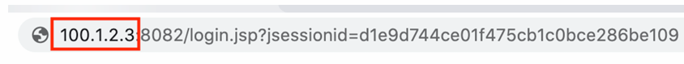
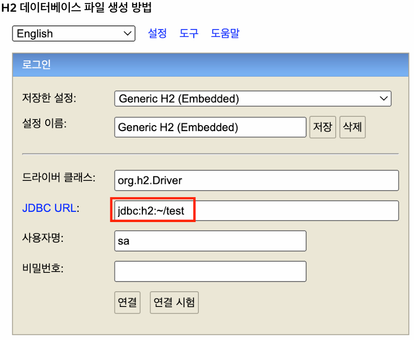
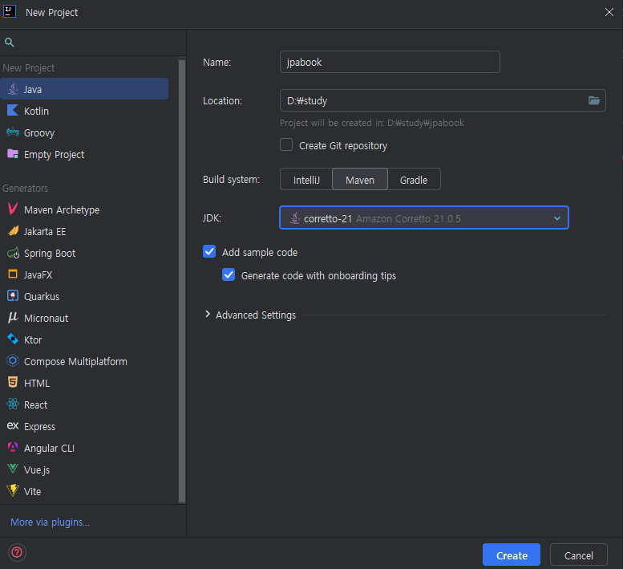
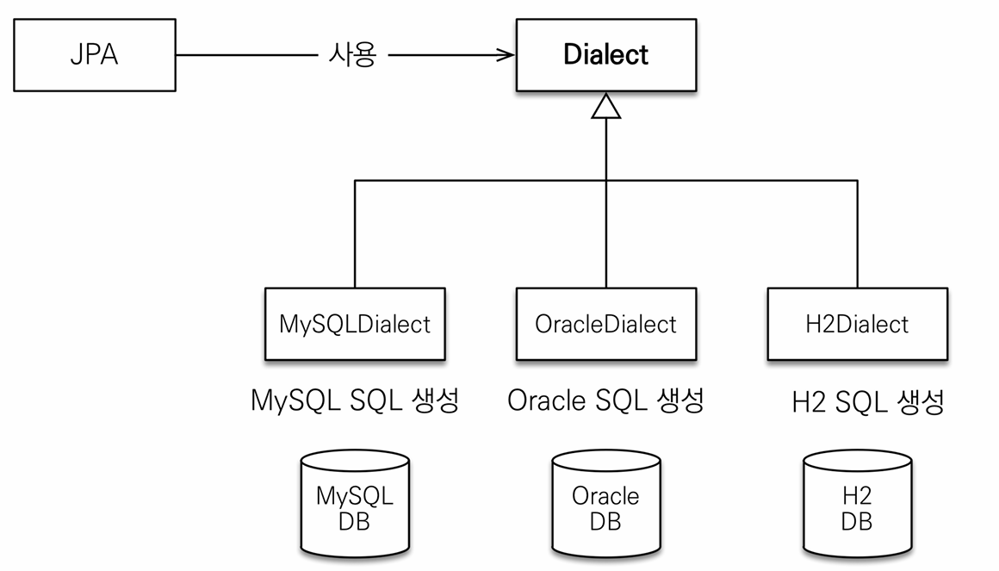

<!-- TOC -->
* [ch02. JPA 시작](#ch02-jpa-시작)
  * [1. H2 데이터베이스 설치](#1-h2-데이터베이스-설치)
  * [2. 프로젝트 설정 및 셋팅](#2-프로젝트-설정-및-셋팅)
    * [라이브러리 추가](#라이브러리-추가)
    * [JPA 설정하기 - persistence.xml](#jpa-설정하기---persistencexml)
      * [데이터베이스 방언(Dialect)](#데이터베이스-방언dialect)
  * [3. 애플리케이션 개발](#3-애플리케이션-개발)
    * [객체 맵핑(Member.class)](#객체-맵핑memberclass)
    * [1. 엔티티 매니저 설정](#1-엔티티-매니저-설정)
      * [1-1. 엔티티 매니저 팩토리 생성](#1-1-엔티티-매니저-팩토리-생성)
      * [1-2. 엔티티 매니저](#1-2-엔티티-매니저)
    * [2. 트랜잭션 관리](#2-트랜잭션-관리)
    * [3. 비지니스 로직(CRUD)](#3-비지니스-로직crud)
      * [JPQL](#jpql)
<!-- TOC -->
# ch02. JPA 시작
현지점(25.01.15) 기준 최신 버전으로 프로젝트를 설정해주었다.
> - Spring Boot 3.4.1
> - Java 21
> - Hibernate 6.6.4
> - h2 2.3.232
> - IDE: IntelliJ 24.3.1

하아버네이트 6버전 이상을 사용할 경우 주의해야할 점
1. Java 17 이상 사용해야한다.
2. javax 패키지 이름을 jakarta로 변경해야한다.
3. H2 데이터베이스를 2.1.214 버전 또는 그 이상으로 사용해야한다.

## 1. H2 데이터베이스 설치


h2 콘솔을 실행하면 위에처럼 ip 주소로 나오는데 해당 ip를 localhost로 변경해준다.(다른 부분은 절대 변경하면 안된다.)   


이후 JDBC URL에 `jdbc:h2:~/test`를 입력한 후 연결을 해준다.   
만약 오류가 나면 자신의 홈디렉토리(윈도우는 사용자 폴더)로 이동해서 빈 `test.mv.db`파일을 만들어주면 된다.   
연결이 완료되었으면 **꼭 연결을 해재한다음 다시 연결을 해준다.**
TCP로 다시 `jdbc:h2:tcp://localhost/~/test` 연결 해준다.
- `jdbc:h2:~/test`로 연결을 유지하면 자바 애플리케이션에서 DB에 접근할 수 없다.
- `jdbc:h2:~/test`로 연결하는 것은 데이터베이스 파일(`test.mv.db`)을 만들기 위해 수행하는 것이다.

> #### 참고 사항
> #### ❗ h2 재설치 시 주의할점
> 이전 버전 삭제 후 홈폴더(C:\Users\..)의 `test.mv.db`파일과 `.h2.server.properties`파일을 삭제해주어야한다.   
> 해당 파일들을 삭제하지 않으면 프로젝트 설정 시 h2 드라이버 클래스를 로드할 수 없는 오류가 난다.

## 2. 프로젝트 설정 및 셋팅
   

- new Project -> java 선택 후 -> 빌드를 Maven으로 선택, 자바 버전 선택 -> 프로젝트 생성   

### 라이브러리 추가
pom.xml에 라이브러리를 추가해준다.    
- h2database 버전은 자신의 로컬에 설치된 버전으로 입력해야한다.
```xml
<?xml version="1.0" encoding="UTF-8"?>
<project xmlns="http://maven.apache.org/POM/4.0.0"
  xmlns:xsi="http://www.w3.org/2001/XMLSchema-instance"
  xsi:schemaLocation="http://maven.apache.org/POM/4.0.0 http://maven.apache.org/xsd/maven-4.0.0.xsd">
  <modelVersion>4.0.0</modelVersion>

  <groupId>jpa-basic</groupId>
  <artifactId>ex1-hello-jpa</artifactId>
  <version>1.0-SNAPSHOT</version>

  <properties>
    <maven.compiler.source>21</maven.compiler.source>
    <maven.compiler.target>21</maven.compiler.target>
    <project.build.sourceEncoding>UTF-8</project.build.sourceEncoding>
  </properties>

  <dependencies>
    <!-- Hibernate -->
    <dependency>
      <groupId>org.hibernate</groupId>
      <artifactId>hibernate-core</artifactId>
      <version>6.4.2.Final</version>
    </dependency>

    <!-- H2 데이터베이스 -->
    <dependency>
      <groupId>com.h2database</groupId>
      <artifactId>h2</artifactId>
      <version>2.3.232</version>
    </dependency>

  </dependencies>
</project>

```

### JPA 설정하기 - persistence.xml
1. resources 폴더 안에 `META-INF` 폴더 생성 후 `persistence.xml` 파일을 생성해준다.
2. 아래 내용을 추가해준다.
```xml
<persistence xmlns="http://xmlns.jcp.org/xml/ns/persistence" xmlns:xsi="http://www.w3.org/2001/XMLSchema-instance" version="2.2" xsi:schemaLocation="http://xmlns.jcp.org/xml/ns/persistence http://xmlns.jcp.org/xml/ns/persistence/persistence_2_2.xsd">
  <persistence-unit name="hello">
    <properties>
      <!--  필수 속성  -->
      <property name="jakarta.persistence.jdbc.driver" value="org.h2.Driver"/>
      <property name="jakarta.persistence.jdbc.user" value="sa"/>
      <property name="jakarta.persistence.jdbc.password" value=""/>
      <property name="jakarta.persistence.jdbc.url" value="jdbc:h2:tcp://localhost/~/test"/>
      <!--  방언 설정  -->
      <property name="hibernate.dialect" value="org.hibernate.dialect.H2Dialect"/>
      
      <!--  옵션  -->
      <property name="hibernate.show_sql" value="true"/> <!--  실행 sql 출력  -->
      <property name="hibernate.format_sql" value="true"/> <!--  출력한 쿼리를 보기 쉽게 정렬 -->
      <property name="hibernate.use_sql_comments" value="true"/>  <!--  주석 출력  -->
      <property name="hibernate.hbm2ddl.auto" value="create"/>   <!--  데이터베이스 스키마 생성에 대한 설정 -->
    </properties>
  </persistence-unit>
</persistence>
```
- JPA 설정은 영속성 유닛(persistence-unit)으로 시작한다.
  - 일반적으로 연결할 데이터베이스당 하나의 영속성 유닛을 등록한다.
  - 고유 이름을 부여해야 한다.(필자는 "hello")로 지정
- 책에 있는 `hibernate.id.new_generator_mappings` 옵션은 Hibernate 6 이후 부터 deprecated되었다.

#### 데이터베이스 방언(Dialect)
   

데이터베이스 밴더마다 제공하는 sql 문법, 함수가 조금식 달라서(타입, 함수, `페이징 처리`) DB를 교체하게 되면 
코드 전체를 수정하는데 큰 어려움이 있다.
하지만 JPA는 특정 데이터베이스에 종속적이지 않은 기술이기 때문에 이런 제약없이 데이터베이스를 쉽게 교체할 수 있다.   
특정 데이터베이스만의 고유한 기능을 JPA에서 방언(Dialect)이라고 하고, JPA는 Dialect클래스를 이용해 해당 코드를 sql쿼리로 만들어주면서 위의 문제를 해결할 수 있다.
그래서 개발자는 DB의 밴더와 상관 없이 JPA 표준 문법에 맞춰서만 개발하면된다.

> #### 참고 persistence.xml(persistence version="3.0"로 변경)
> Java 17 이상에서 Hibernate 6.x 이상을 사용해야한다. 이는 `javax.persistence` 네임 스페이스가 
> `jakarta.persistence`로 변경된 JPA 3.x 버전을 사용해야한다.(원칙적으로)   
> 다만 김영한님이 올려주신 최신 버전 코드에서 2.2 버전으로 설정된 이유는
> xml 스키마 내용이 2.2와 대부분 호환 되고, 혹시 모를 기존 강의와의 호환성 문제 등을 
> 고려해서 버전을 2.2로 사용하셨다고 한다. 그래서 위의 2.2 버전으로 사용해도 무관하다.   
> 하지만 필자는 이미 3.X 버전으로 변경했기에.... 해당 부분을 첨부하겠다.
> ```xml
> <?xml version="1.0" encoding="UTF-8"?>
> <persistence version="3.0" xmlns="https://jakarta.ee/xml/ns/persistence" xmlns:xsi="http://www.w3.org/2001/XMLSchema-instance" xsi:schemaLocation="https://jakarta.ee/xml/ns/persistence https://jakarta.ee/xml/ns/persistence/persistence_3_0.xsd">
>   <persistence-unit name="hello">
>     <provider>org.hibernate.jpa.HibernatePersistenceProvider</provider>
>     <properties>
>       <!-- 필수 속성 -->
>       <property name="jakarta.persistence.jdbc.driver" value="org.h2.Driver"/>
>       <property name="jakarta.persistence.jdbc.user" value="sa"/>
>       <property name="jakarta.persistence.jdbc.password" value=""/>
>       <property name="jakarta.persistence.jdbc.url" value="jdbc:h2:tcp://localhost/~/test"/>
>       <!-- 방언(dialect) 설정 -->
>       <property name="hibernate.dialect" value="org.hibernate.dialect.H2Dialect"/>
> 
>       <!-- 옵션 -->
>       <property name="hibernate.show_sql" value="true"/>
>       <property name="hibernate.format_sql" value="true"/>
>       <property name="hibernate.use_sql_comments"  value="true"/>
>       <!-- 데이터베이스 스키마를 자동으로 생성, 업데이트, 유지 또는 삭제하는 방법을 지정
>       create: 시작할 때마다 데이터베이스 스키마를 새로 생성합니다. 이미 존재하는 경우에는 삭제 후 재생성.
>           -->
>       <!--      <property name="hibernate.hbm2ddl.auto" value="create" />-->
>     </properties>
>   </persistence-unit>
> </persistence>
> ```
> persistence 3.0 이상에서는 [http://xmlns.jcp.org/xml/ns/persistence](http://xmlns.jcp.org/xml/ns/persistence)가 아닌 [https://jakarta.ee/xml/ns/persistence](http://xmlns.jcp.org/xml/ns/persistence)를 사용해야함
> <provider> 태그를 추가해 Hibernate 6 이상 버전에서 사용하는 Provider를 기입

## 3. 애플리케이션 개발
### 객체 맵핑(Member.class)
JPA는 매핑 어노테이션을 분석해 어떤 객체가 어떤 테이블과 연관관계가 있는지 알아낸다.
```java
@Entity
@Table(name = "MEMBER")
class Member {

    @Id
    private Long id;

    @Column(name = "NAME")
    private String userName;
    private Integer age;
  ...
}
```
- @Entity
  - 테이블과 클래스를 매핑
  - 매핑된 클래스를 엔티티 클래스라고 함
- @Table
  - 엔티티 클래스에 매핑할 테이블정보를 알려줌
  - name 속성를 사용해 매핑
- @Id
  - pk 매핑
- @Colum
  - 필드를 컬럼에 매핑

**이제 코드를 작성해보자**
```java
public class Main {

    public static void main(String[] args) {
        //엔티티 메니저 팩토리 생성, xml에 지정한 (persistence-unit 값을 persistenceUnitName인자로 
        EntityManagerFactory emf = Persistence.createEntityManagerFactory("hello");
        //엔티티 매니저 생성
        EntityManager em = emf.createEntityManager();

        //트랜잭션 획득
        EntityTransaction tx = em.getTransaction();

        try {
            //트랜젝션 시작
            tx.begin();
            logic(em); // 로직 실행
            tx.commit; // 커밋
        } catch (Exception e) {
            tx.rollback();
        } finally {
            em.close();
        }

        emf.close();
    }
}
```
위의 코드는 크게 3가지로 구분 된다.
1. 엔티티 매니저 설정
2. 트랜잭션 관리
3. 비즈니스 로직

### 1. 엔티티 매니저 설정
#### 1-1. 엔티티 매니저 팩토리 생성
- persistence.xml 설정 정보를 사용해 엔티티 매니저 팩토리 생성(Persistence 클래스 사용)
- Persistence 클래스가 엔티티 매니저 팩토리를 생성해 JPA를 사용할 수 있게 준비
- persistence.xml에서 이름이 "hello"(해당 프로젝트에서)인 영속성 유닛을 찾아 엔티티 매니저 팩토리 생성
- persistence.xml 설정보를 읽어 JPA를 동작시키기 위한 기반 객체를 만들고 데이터 베이스 커넥션 풀을 생성 등
- `엔티티 매니저 팩토리는 애플리케이션 전체에서 딱 한번만 생성하고 공유해서 사용`
- 애플리케이션을 종료할 때 엔티티 매니저 팩토리도 종료해야함
#### 1-2. 엔티티 매니저
- 엔티티 매니저 팩토리에서 엔티티 매니저 생성
- jpa의 대부분 기능은 엔티티 매니저가 제공 (CRUD)
- 엔티티 매니저는 내부에 데이터소스(커넥션)을 유지하면서 데이터베이스와 통신
- `데이터베이스 커넥션과 밀접한 관계가 있어서 스레드간에 공유하거나 재사용하면 안됨`
- 사용이 끝난 엔티티 매니저는 종료

### 2. 트랜잭션 관리
- 트랜잭션 안에서 데이터를 변경해야함
- 트랜잭션 API를 사용해서 비지니스 로직이 정상 동작하면 커밋하고 예외가 발생하면 롤백함

### 3. 비지니스 로직(CRUD)
```java
...
//저장
Member member = new Member();
member.setId(1L);
member.setName("member1");
em.persist(member);

//조회
Member findMember = em.find(Member.class, 1L);
// 수정은 객체 수정만으로 수정한다.
findMember.setName("newName");

//JPQL 전체 맴버 조회-> 
List<Member> result = em.createQuery("select m from Member as m", Member.class)
        .getResultList();
...
```
#### JPQL
- 객체지향 쿼리 언어로 SQL문법과 거의 유사하다.
- 대상
  - PQL : 엔티티 객체를 대상으로 쿼리함(위에서 Member는 테이블이 아니라 객체를 말하는 것)
  - SQL : 데이터베이스 테이블 대상으로 쿼리
