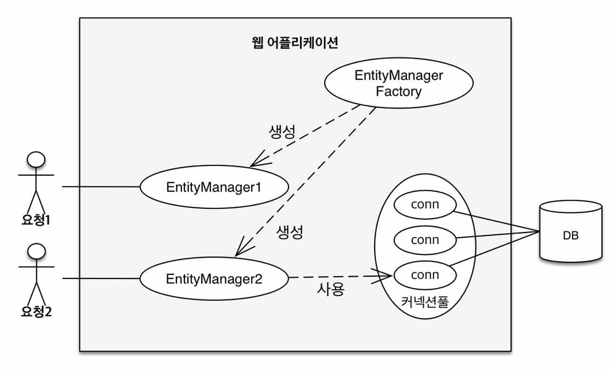
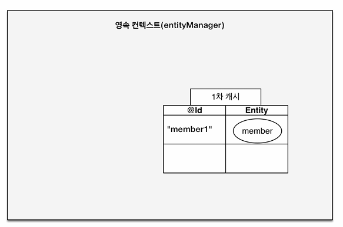
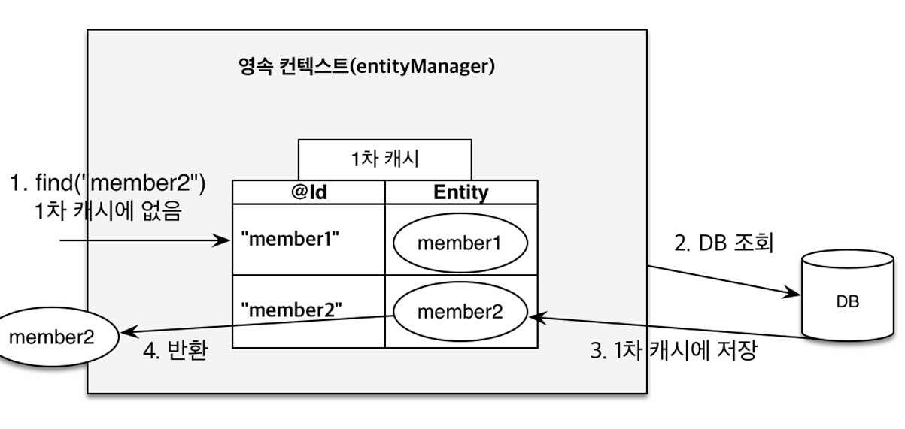
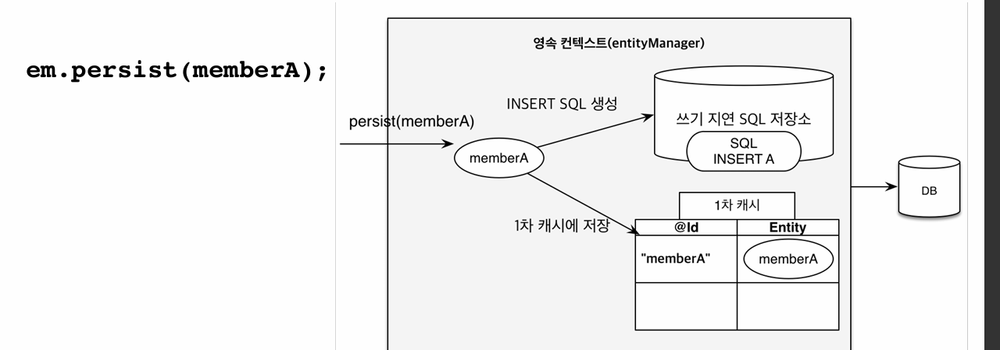
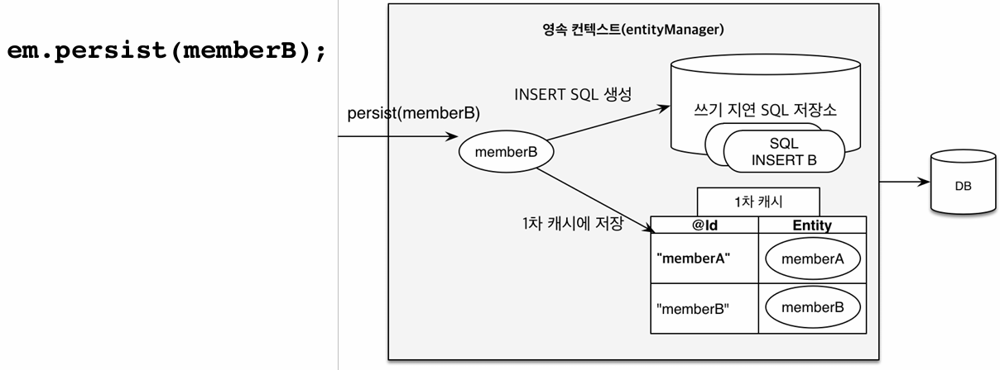
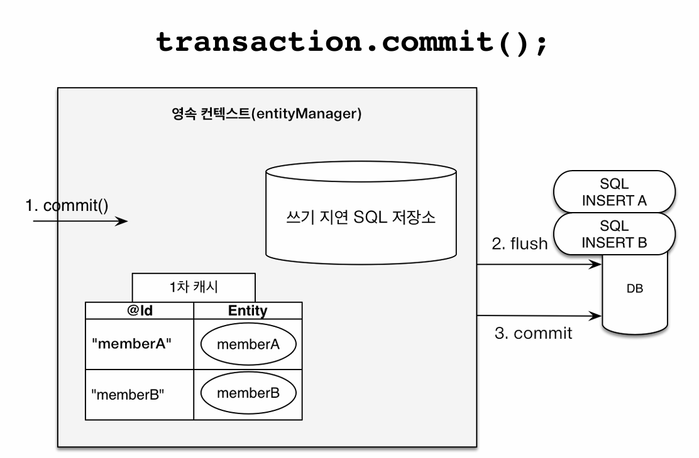
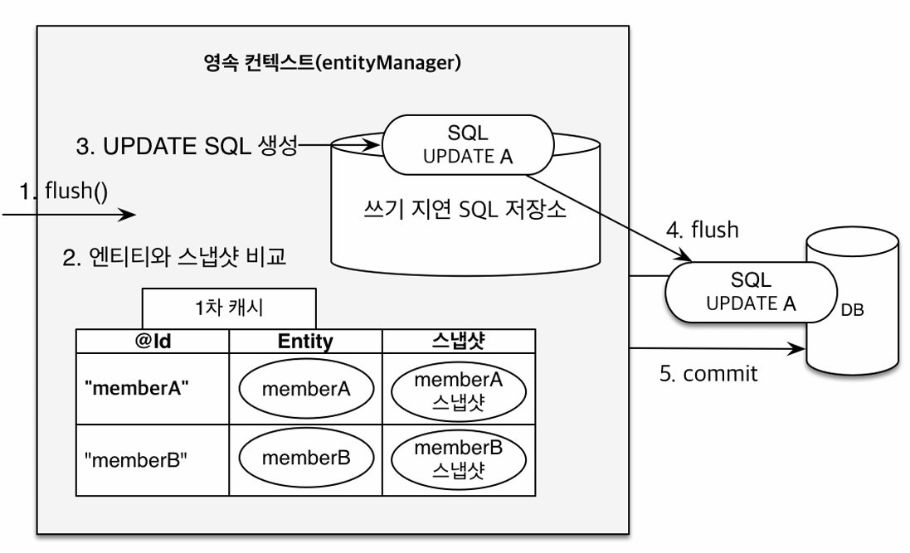

<!-- TOC -->
  * [1. 엔티티 매니저 팩토리와 엔티티 매니저](#1-엔티티-매니저-팩토리와-엔티티-매니저)
    * [엔티티 매니저 팩토리](#엔티티-매니저-팩토리)
    * [엔티티 매니저](#엔티티-매니저)
  * [2. 영속성 컨텍스트](#2-영속성-컨텍스트)
  * [3. 엔티티 생명주기](#3-엔티티-생명주기)
  * [4. 영속성 컨텍스트 특징](#4-영속성-컨텍스트-특징)
    * [4-3-1. 1차 캐시](#4-3-1-1차-캐시)
    * [4-3-2. 영속 엔티티의 동일성 보장](#4-3-2-영속-엔티티의-동일성-보장)
    * [4-3-3. 트랜잭션을 지원하는 쓰기 지연](#4-3-3-트랜잭션을-지원하는-쓰기-지연)
    * [4-3-4. 변경 감지(dirty checking)](#4-3-4-변경-감지dirty-checking)
  * [5. 플러시](#5-플러시)
    * [flush() 실행 시 동작되는 과정](#flush-실행-시-동작되는-과정)
    * [영속성 컨텍스트가 플러시 하는 방법](#영속성-컨텍스트가-플러시-하는-방법)
    * [주의할 점](#주의할-점)
    * [플러시 모드 옵션](#플러시-모드-옵션)
  * [6. 준영속](#6-준영속)
    * [6-1. 준영속 상태의 특징](#6-1-준영속-상태의-특징)
    * [6-2. merge() 병합](#6-2-merge-병합)
<!-- TOC -->
--- 
## 1. 엔티티 매니저 팩토리와 엔티티 매니저


### 엔티티 매니저 팩토리
- 엔티티 매니저를 만드는 공장
- 비용이 많이 듬 -> 전체 애플리케이션에서 하나만 만들어 스레드 간 공유
- 생성할 때 커넥션 풀을 만든다.

### 엔티티 매니저
- 엔티티 매니저 팩토리에서 만듬
- 비용이 거의 안듬
- 절대 동시에 스레드에 접근한면 안됨(동시성 문제 발생)
- 연결이 필요한 시점까지 디비에 커넥션을 얻지 않음(보통 트랜잭션을 시작할 때 커넥션을 획득한다.)
- J2SE 환경에서는 엔티티 매니저를 만들면 그 내부에 영속성 컨텍스트도 함께 만들진다.
- 엔티티 매니저를 통해 영속성 컨텍스트에 접근할 수 있다.

## 2. 영속성 컨텍스트
- 엔티티를 영구 저장하는 환경
- 엔티티 매니저로 엔티티를 저장(persist)하거나 조회(find)하면 엔티티 매니저는 영속성 컨텍스트에 엔티티를 보관, 관리한다.
- 논리적인 개념, 눈에 보이지 않음
- 엔티티 매니저를 통해 영속성 컨텍스트에 접근, 여러 엔티티 매니저가 같은 영속성 컨텍스트에 접근할 수 도 있음

## 3. 엔티티 생명주기
```java
public void entityLifeCycle(long memberId) {
    EntityManager em = emf.createEntityManager();
    EntityTransaction tx = em.getTransaction();

    tx.begin();

    try {
        //1. 비영속 상태
        Member member = new Member();
        member.setId(memberId);
        member.setName("HelloJPA");

        //2. 영속 상태 -> 이때 db에 저장 되는 것이 아님
        em.persist(member);
        em.detach(member);  // 3. 준영속 상태
        em.remove(member);  // 4. 삭제 상태


        tx.commit();    //트랜젝션 커밋하는 시점에 쿼리가 날려짐
    } catch (Exception e) {
        tx.rollback();
    } finally {
        em.close();
    }
}

```
1. 비영속(new/transient) : 순수 객체 상태, 아직 영속성 컨텍스트나 데이터베이스와 전혀 관련 없는 상태
2. 영속(managed) : 엔티티 매니저를 통해 엔티티를 영속성 컨텍스트에 저장한 상태 
   - em.persist(entity)사용하거나 em.find(Class<T>, id), JPQL을 사용해 조회한 엔티티는 영속 상태가 된다.
3. 준영속(detached) 영속성 컨텍스트에 저장되었다가 분리된 상태
   - 관리하던 영속 상태의 엔티티를 더 이상 관리하지 않음
   - em.detach(entity), em.close(), em.clear()
4. 삭제(removed) : 삭제된 상태
    - 엔티티 영속성 컨텍스트와 데이터베이스에서 삭제한다.
    - 쿼리 저장소에서 삭제
    - remove()하는 순간 영속성 컨텍스트에서 해당 엔티티가 제거 된다.
    - 삭제된 엔티티는 재사용하지 말고 자연스럽게 가비지 컬렉션의 대상이 되도록 두는 것이 좋다.

## 4. 영속성 컨텍스트 특징
1. 영속성 컨텍스트는 엔티를 식별자 값(@Id)로 구분한다.
2. JPA는 트랜잭션을 커밋하는 순간 영속성 컨텍스트에서 데이터베이스로 내용을 반영한다.(flush)
3. 영속성 컨텍스트가 엔티티를 관리하면 다음과 같은 장점이 있다.
   - 1차 캐시
   - 동일성 보장
   - 트랜잭션을 지원하는 쓰기 지연
   - 변경 감지
   - 지연 로딩

### 4-3-1. 1차 캐시
- 영속성 컨텍스트 내부에 있는 캐시
- 영속 상태의 엔티티는 모두 여기에 저장된다.
- 1차 캐시의 key값은 엔티티의 식별자 값(데이터 베이스 기본키와 매핑되어 있다.)

  
- em.persist(member1)를 호출하면 db에 저장되는 것이 아니라 1차 캐시에 저장된다.

  
- em.find(Member.class, member2)을 호출하게 되면 아래와 절차로 실행된다.
  1. 호출한 member2가 1차 캐시에 있는지 확인
  2. member2가 있으면 해당 엔티티 리턴
  3. member2가 없으면 DB에서 조회 후 1차 캐시에 해당 엔티티를 저장 후 리턴
- 엔티티들을 조회할 때 메모리에 있는 1차 캐시에서 바로 불러와 성능상 이점을 얻을 수 있다고 한다.(사실 큰 도움은 별로 안된다고 한다.)
  - 보통 엔티티 메니저는 트렌젝션 단위로 만들어지는데, 고객의 요청이 들어와서 비지니스가 끝나버리면   
    영속성 컨텍스트를 지운다(close())한다는 것을 의미한다. 이 말은 1차 캐시도 다 지워지게 된다.   
    비즈니스 로직이 엄청 복잡할 경우는 도움이 될 수 있지만, 그렇지 않은 경우 큰 도움은 별로 안된다고 한다.

### 4-3-2. 영속 엔티티의 동일성 보장
```java
public void entityIdentity(long memberId) {

    addMember(memberId); //add member
    System.out.println("========= Start entityIdentity ==============");

    EntityManager em = emf.createEntityManager();
    EntityTransaction tx = em.getTransaction();

    tx.begin();

    try {
        Member a = em.find(Member.class, memberId);
        Member b = em.find(Member.class, memberId);


        System.out.println(a == b);
        //자바 컬랙션 처럼 동일성 보장해준다.
        //1차 캐시로 반복가능한 읽기(REPEATABLE READ) 등급의 트랜잭션 격리 수준을 데이터베이스가 아닌
        //애플리케이션 차원에서 제공한다.

        tx.commit();
    } catch (Exception e) {
        tx.rollback();
    } finally {
        em.close();
    }

    System.out.println("========= end entityIdentity ==============");
}
```
- 실별자가 같으면 같은 엔티티다. : 동일성을 보장한다.

### 4-3-3. 트랜잭션을 지원하는 쓰기 지연
#### 쓰기 지연 SQL 저장소
영속성 컨텍스트에는 1차 캐시 뿐만 아니라 쓰기 지연 SQL 저장소가 있다.
em.persist(memberA)를 한다고 하면 memberA를 바로 db에 반영하는 것이 아니라
memberA를 저장하는 insert sql 문을 생성해서 지연 SQL 저장소에 저장한다.    
이후 트랜잭션이 커밋되면 쓰기 지연 SQL 저장소에 있는 쿼리들을 DB에 flush(반영)한 후 DB에 커밋한다.     
이렇게 영속성 컨텍스트에 변경이 발생했을 때 바로 DB에 쿼리를 보내지 않고 쓰기 지연 SQL 저장소(버퍼)에 쌓아두었다가 
영속성 컨텍스트가 flush하는 시점에 SQL쿼리를 DB에 보내는 기능을 바로 `트랜잭션을 지원하는 쓰기 지연(transctional write-behind)`라고 한다.
```java
    public void transactionWriteBehind(long memberAId, long memberBId) {
        System.out.println("========= Start transactionWriteBehind ============");

        EntityManager em = emf.createEntityManager();
        EntityTransaction tx = em.getTransaction();

        tx.begin(); //트랜잭션 시작

        try {
            Member memberA = new Member(memberAId, "memberA");
            Member memberB = new Member(memberBId, "memberB");

            em.persist(memberA);    //1. memberA를 영속
            em.persist(memberB);    //2. memberB를 영속
            //여기서 INSERT SQL를 디비에 보내지 않는다. : 쓰기 지연 SQL 저장소에 쌓이게 됨
            System.out.println("!!!!!!!! After em.persist !!!!!!!!");

            tx.commit();    //3. 커밋하는 순간 데이터베이스에 INSERT 쿼리를 날린다.
        } catch (Exception e) {
            tx.rollback();
        } finally {
            em.close();
        }

        System.out.println("========= End transactionWriteBehind ============");
    }
```
위의 코드를 그림으로 살펴보면 다음과 같다.    

 

- 1,2 :  memberA,  memberB를 1차캐시와 쓰기 지연 SQL 저장소에 저장한다.



- 트랜젝션을 commit하면 DB에 flush -> commit한다.

### 4-3-4. 변경 감지(dirty checking)
JPA로 엔티티를 수정할 때는 단순히 엔티티를 조회해서 데이터만 변경하면 된다.    
그 이유는 영속성 컨텍스트의 1차 캐시에 스냅샷을 보관해서 그렇다. 여기서 스냅샷은 엔티티의 최초의 상태를 스냅샷으로 남겨둔 것을 말한다.



엔티티가 변경 감지 기능으로 수정되는 과정은 다음과 같다.
0. 엔티티를 영속성 컨텍스트에 보관할 때, 최초 상태를 스냅샷으로 저장한다.
1. 트랜잭션을 커밋한다.
2. 1차 캐시에 있는 엔티티 값과 스냅샷의 값들을 비교해서 변경 사항이 있으면 
3. 쓰기 지연 SQL 저장소에 쿼리를 생성해서 보낸다.
4. 해당 쿼리를 DB에 반영하고 commit한다.

이런 변경 감지는 영속성 컨텍스ㅡ가 관리하는 영속 상태의 엔티티만 적용이 된다.

#### 변경 감지 시 update 되는 필드
member를 조회해서 member의 name값만 변경한다음 commit하게 되면 아래와 같이 쿼리문이 날아가는 것을 확인해 볼 수 있다.
```sql
UPDATE MEMBER
SET
  NAME=?
  AGE=?
WHERE
  ID=?
```
이는 변경 감지로 생성되는 쿼리는 변경한 필드뿐만 아나라 엔티티의 모든 필드를 업데이트하기 때문이다.   
이렇게 모든 필드를 사용하면 데이터베이스에 보내는 데이터 전송량이 증가하는 단점이 있지만, 아래와 같은 이유들로 모든 필드를 업데이트 한다.
- 모든 필드를 사용하면 수정 쿼리가 항상 같다(물론 바이딩되는 데이터는 다름)
- 애플리케이션 로딩 시점에 수정 쿼리를 미리 생성해두고 재 사용할 수 있다.
- 데이터베이스에 동일한 쿼리를 보내면 데이터베이스는 이저에 한번 파싱된 쿼리를 재사용할 수 있다.
- 상황에 따라 다르지만 컬럼이 대략 30개 이상이 되면 성능이 안좋아 질 수 있지만 보통 컬럼이 30개 이상 넘어가는 경우가 없다...
  - 만약 이럴 경우 하이버네이트 확장 기능인 `@DynamicUpdate`를 해당 엔티티 클래스에 추가하면    
  변경된 필드만 update하는 쿼리를 만들어 준다.(상황에 따라 직접 테스트해서 적용하면 된다.)


## 5. 플러시
영속성 컨텍스트의 변경 내용을 데이터베이스에 반영하는 것을 말한다.(DB에 커밋한다는 의미가 아니다.)    
### flush() 실행 시 동작되는 과정
1. 트랜젝션이 커밋되면 자동으로 플러시가 발생한다.
2. 변경 감지 동작(영속성 컨텍스트의 모든 엔티티를 스냅샷과 비교하고, 변경된 쿼리를 만들어 쓰기 지연 SQL 저장소에 등록)
3. 쓰기 지연 sql 저장소의 쿼리를 데이터 베이스에 전송한다(C,U,D)
4. DB에 변경사항을 commit()한다.

### 영속성 컨텍스트가 플러시 하는 방법
1. em.flush(); 처럼 직접 호출
  - 테스트나 다른 프레임워크와 함께 사용할 때를 제외하고 거의 사용하지 않는다.
2. 트랜잭션을 커밋할 때 자동으로 호출된다.
3. JPQL 쿼리 실행 시 자동으로 호출된다.
    - JPQL은 SQL로 변환 되어서 데이터베이스에서 엔티티를 조회하는데, 만약 영속성 컨텍스트에는 있지만 아직 데이터베이스에 반영안된 값들이 존재하면 반영 안된 값들을 조회해올 수 가 없다. 
    ```java
    public void jpql() {
        ...
        em.persist(memberA);
        em.persist(memberB);
        em.persist(memberC);
        
        query = em.createQuery("select m from Member m", Member.class);
        List<Member> members = query.getResultList();
    }
    ```
   JPQL이 자동으로 flush()를 호출 안 한다면 memberA,B,C를 조회할 수 없게 된다.

### 주의할 점
플러시는 영속성 컨텍스트에 보관된 엔티티를 지우는 것이 아니라 `변경 내용을 데이터베이스에 동기화하는 것`이다.   
즉 1차 캐시가 지워지는 것이 아니라 쓰기 지연 SQL 저장소에 있는 쿼리(C,U,D)들이 DB에 반영(동기화)이 되는 과정이다.

### 플러시 모드 옵션
em.setFlushMode()로 플러시 모드도 설정할 수 있다.
- FlushModeType.AUTO :  커밋이나 쿼리 실행할 때 플러시 (기본값)
- FlushModeType.COMMIT : 커밋할 때 만 플러시
    - 성능 최적화를 위해 사용할 수 있다(10장에 나옴)

## 6. 준영속
- 영속에서  분리된 상태로 영속성 컨텍스트가 제공하는 기능ㅇ르 사용할 수 없다.
- 방법은 다음과 같다.
  - em.detach(entity)
    - 특정 엔티티만 준영속 상태로 전환
  - em.clear()
    - 영속성 컨텍스트를 완전히 초기화
  - em.close()
    - 영속성 컨텍스트를 종료
    - 보통 영속성 컨텍스트가 종료되면서 준영속 상태가된다.
    - 개발자가 직접 준영속 상태를 만드는 일은 매우 드물다.
> 궁금한점...?
> ```java
> public void testDetached() {
> 
>     //비영속 상태
>     Member member = new Member(1L, "memberA");
>     
>     //영속 상태
>     em.persit(member);
>     
>     //member를 영속성 컨텍스트에 분리(준영속)
>     em.detach(member);
>     
>     tx.commit();
> }
> ```
> 위의 코드를 실행하면 로그에 insert 쿼리가 찍히고 DB에 반영이 안되는데, 왜 insert 쿼리가 찍힐까요...?   
> find -> setName -> detach 하게 되면 update는 안찍히고 select만 찍히는데...


### 6-1. 준영속 상태의 특징
- 거의 비영속 상태에 가깝다. : 1차 캐시, 쓰기 지연, 변경 감지 등 영속성 컨텍스트가 제공하는 어떤 기능도 동작하지 않는다.)
- 식별자 값을 가지고 있다. : 비영속 상태는 식별자 값이 없을 수 도 있지만, 준영속 상태는 이미 한번 영속 상태여서 반듯이 식별자 값을 가지고 있다.
- 지연 로딩을 할 수 없다
  - 지연 로딩은 실제 객체 대신해서 프록시 객체를 로딩해두고 해당 객체를 실제 사용할 때 영속성 컨텍스트를 통해 데이터를 불러오는 방식이다.   
    하지만 준영속 상태는 영속성 컨텍스트가 더이상 관리하지 않으니 지연로딩 시 문제가 발생한다.

### 6-2. merge() 병합
- 준영속 -> 영속 상태로 변경
- merge() 메소드는 준영속 상태의 엔티티를 받아서 그 정보로 새로운 영속상태의 엔티티를 반환한다.
```java
    public void merge(long memberId) {
        System.out.println("========= Start merge ============");

        Member member = createMemberForMerge(memberId, "member");   //영속성 컨텍스트1로 member를 만듬
        member.setName("new Name"); //준영속 상태에서 변경
        mergeMember(member);    //준영속 상태의 엔티티의 변경사항을 반영하기 위해 mergeMember에서 다시 영속상태로 변경
    }

    private void mergeMember(Member member) {
        System.out.println("//==영속성 컨텍스트2 시작==//");
        EntityManager em2 = emf.createEntityManager();
        EntityTransaction tx2 = em2.getTransaction();

        tx2.begin();
        Member mergedMember = em2.merge(member);//정확히는 member 엔티티가 준영속상태에서 영속 상태로 변경 되는 것이 아니라,
        // mergedMember라는 새로운 영속 상태의 엔티티가 반영된다.
        member.setName("new new Name"); //member는 이제 사용할 필요 가 없음
        tx2.commit();

        //준영속 상태
        System.out.println("member = " + member.getName());

        //영속상태
        System.out.println("mergedMember = " + mergedMember.getName());


        System.out.println("em2 contains member = " + em2.contains(member));
        System.out.println("em2 contains mergedMember = " + em2.contains(mergedMember));

        em2.close();

        // 조회해보면 name은 new new Name가 아닌 new Name으로 되어있음
        EntityManager em3 = emf.createEntityManager();
        EntityTransaction tx3 = em3.getTransaction();
        tx3.begin();
        Member findMember = em3.find(Member.class, member.getId());
        System.out.println("findMember = " + findMember.getName());
        tx3.commit();

        em3.close();
        System.out.println("//==영속성 컨텍스트2 종료==//");
    }

```
- merge() 메소드는 비영속 엔티이도 영속상태로 만들 수 있다.
