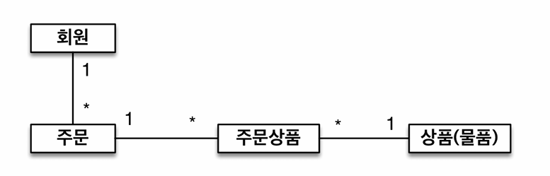
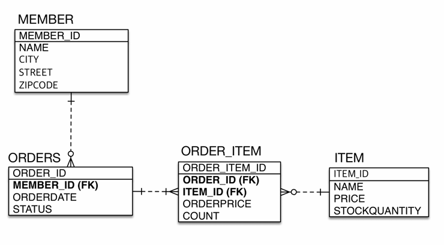
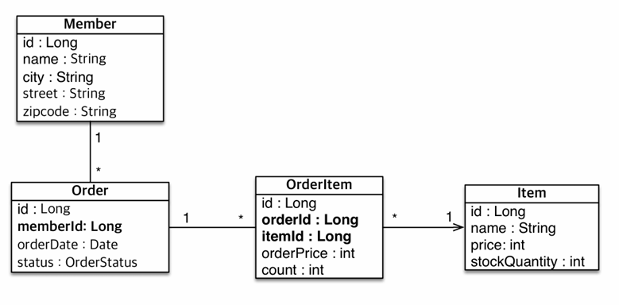

# 4장 엔티티 매핑
JPA에서 중요한 2가지는 매커니즘적인 측면(어떻게 작동하는지 즉, 영속성)과 실제 설계적인 측면(객체와 rdb와 어떻게 매핑해서 쓰는지)이다.    
이번 장에서는 엔티티를 어떻게 매핑하는지(실제 설계적인 측면) 알아본다.

<!-- TOC -->
* [1. 객체와 테이블 매핑](#1-객체와-테이블-매핑)
  * [1-1. @Entity](#1-1-entity)
  * [1-2. @Table](#1-2-table)
* [2. 데이터베이스 스키마 자동 생성](#2-데이터베이스-스키마-자동-생성)
  * [hibernate.hbm2ddl.auto 속성 설정](#hibernatehbm2ddlauto-속성-설정)
* [3. 필드와 컬럼 매핑](#3-필드와-컬럼-매핑)
  * [@Column](#column)
  * [@Enumerated](#enumerated)
  * [@Temporal](#temporal)
  * [@Lob](#lob)
  * [@Access](#access)
  * [참고](#참고)
* [4. DDL 생성 기능](#4-ddl-생성-기능)
* [5. 기본 키 매핑](#5-기본-키-매핑)
  * [GenerationType.AUTO](#generationtypeauto)
  * [GenerationType.IDENTITY](#generationtypeidentity)
  * [GenerationType.SEQUENCE](#generationtypesequence)
  * [GenerationType.TABLE](#generationtypetable)
  * [식별자 선택 전략](#식별자-선택-전략)
* [6. 실정 예제(요구사항 분석과 기본 매핑)](#6-실정-예제요구사항-분석과-기본-매핑)
  * [요구사항 분석](#요구사항-분석)
  * [도메인 모델 분석](#도메인-모델-분석)
  * [테이블 ERD](#테이블-erd)
  * [엔티티 설계(erd 기반)](#엔티티-설계erd-기반)
  * [엔티티 설계에 따른 구현](#엔티티-설계에-따른-구현)
  * [해당 설게의 문제점](#해당-설게의-문제점)
<!-- TOC -->


## 1. 객체와 테이블 매핑
JPA에서 매핑 어노테이션을 지원한다.
- 객체와 테이블 매핑 : @Entity, @Table
- 기본키 매핑 : @Id
- 필드와 컬럼 매핑 : @Column
- 연관관계 매핑 : @ManyToOne, @JoinColumn -> 5,6,7 장에서

### 1-1. @Entity
- 테이블과 클래스를 매핑할 때 사용
- @Entity 어노테이션이 붙은 클래스를 엔티티라고 하고, JPA가 관리한다.

#### 속성 값
- name
  - JPA에서 사용할 엔티티 이름을 지정한다.
  - 기본값 : 클래스 이름을 그대로 사용
  - 보통 기본값을 사용하지만, 같은 이름의 엔티티 크래스가 있으면 이름을 지정해야한다.(충돌 방지)
#### 주의 사항
- 기본 생성자는 필수다. (파라미터가 없는 public 또는 protected)
- final, enum, interface, inner 클래스에서는 사용할 수 없다.
- 저장할 필드에 final 사용하면 안된다.


### 1-2. @Table
- 엔티티와 매핑할 테이블을 지정한다.
- 생략하면 매핑한 엔티티 이름을 테이블 이름으로 사용한다.

#### 속성 값
| 속성                          | 기능                                                                                       | 가본값    |
|-----------------------------|------------------------------------------------------------------------------------------|--------|
| name                        | 매핑할 테이블 이름                                                                               | 엔티티 이름 |
| catalog                     | catalog기능이 있는 데이터베이스에서 catalog 매핑                                                        |        |
| schema                      | 스키마기능이 있는 데이터베이스에서 스키마 매핑                                                                |        |
| uniqueConstraints<br/>(DDL) | DDL생성 시 유니크 제약조건을 만듬<br/>2개 이상의 복합 유니크 제약조건도 만들 수 있음<br/>스키마 자동 생성 기능을 사용해 DDL을 만들 때만 사용 |        |

## 2. 데이터베이스 스키마 자동 생성
- JPA는 매핑 정보와 데이터베이스 방언을 사용해 스키마를 자동으로 생성하는 기능을 지원
- 개발자가 작접 테이블을 생성하는 수고르 덜 수 있지만 `운영에서는 참고만 하자(완벽하지 않음)`
### hibernate.hbm2ddl.auto 속성 설정
persistence.xml 파일에 다음과 같이 지정
```xml
<property name="hibernate.hbm2ddl.auto" value="create" />
```
#### 옵션값
| 옵션          | 설명                                                                 |
|-------------|--------------------------------------------------------------------|
| create      | 기존 테이블 삭제 후 다시 생성(drop + create)                                   |
| create-drop | drop + create + drop<br/>애플리케이션 종료 시점에 생성한 DDL 제거                  |
| update      | 매핑 정보를 비교해 변경 사항만 수정                                               |
| validate    | 테이블과 엔티티 매핑 정보를 비교해 validate확인<br/>차이가 있으면 경고를 날리고 애플리케이션이 실행되지 않음 |
| none        | 자동생성 기능를 사용하지 않음<br/>해당 속정 자체를 아예 삭제하는 것과 동일                       |

#### 속성 사용 시 주의 사항
- 운영 서버에서는 절대 `create`, `create-drop`, `update`처럼 DDL을 수정하는 옵션은 절대 사용하면 안됨
- 추천 정략
  - 초기(local) : create or update
  - 초기화 상태로 자동화된 테스트 진행하는 개발자 환경 or CI 서버 : create 또는 create-drop
  - 테스트 서버 : update, validate
  - 스테이징과 운영 : validate, none

## 3. 필드와 컬럼 매핑
JPA가 제공하는 필드와 컬럼 매핑용 어노테이션을 정리하였다. (간단히 보고 필요할 때 찾아보는 것을 권장)
- 필드와 컬럼
  - @Column(name = "NAME") : 컬럼을 매핑
  - @Enumerated(EnumType.STRING) : enum타입 맵핑
  - @Temporal(TemporalType.TIMESTAMP) : 날짜 타입 매핑
  - @Lob : BLOB, CLOB 매핑
  - @Transient : 특정 필드 맵핑X, 어떤 값을 임시로 보관하고 싶을 때
- 기타
  - @Access(AccessType.FIELD) : JPA가 엔티티에 접근하는 방식을 지정

```java
@Entity
@Table(name = "MEMBER")
@Access(AccessType.FIELD)   //JPA가 엔티티에 접근하는 방식을 지정
class Member {

    @Id
    private Long id;

    @Column(name = "NAME")  // 컬럼을 매핑
    private String userName;

    @Enumerated(EnumType.STRING)    // enum타입 맵핑
    private RoleType roleType;

    @Temporal(TemporalType.TIMESTAMP)   // 날짜 타입 매핑
    private Date createDate;

    private LocalDateTime lastModifiedDate;

    @Lob    //BLOB, CLOB 매핑
    private String description;

    @Transient  // 특정 필드 맵핑X, 어떤 값을 임시로 보관하고 싶을 때
    private String tempValue;
    
    @Column(columDefinition = "varchar(100) default 'EMPTY'")
    private String data;
}
```
### @Column
| 속성                                   | 기능                                                                                                             | 기본값                                         |
|--------------------------------------|----------------------------------------------------------------------------------------------------------------|---------------------------------------------|
| name                                 | 필드와 매핑할 테이블의 컬럼 이름                                                                                             | 객체의 필드 이름                                   |
| unique(DDL)                          | @Table의 uniqueConstraints와 같지만, 한 컬럼에 간단히 제약조건을 걸 때 사용<br/> uk값이 렌덤으로 생성되어 @Table의 uniqueConstraints을 보통 사용한다. | false                                       |
| nullable                             | null 값 혀옹 여부<br/>DDL 생성시 not null 제약조건이 붙음                                                                     | true                                        |
| insertable, updatable<br/>(거의 사용 안함) | 엔티티 저장/수정 시 해당 필도도 같이 저장하는지 여부<br/> false 옵션은 읽기 전용일 때 사용                                                      | true                                        |
| columDefinition                      | 데이터베이스 컬럼 정보를 직접 줄 수 있음<br/> ex) columnDefinition = "varchar(100) default 'EMPTY'"                             | 필드의 타입과 방언 정보를<br/>사용해 적절해 생성               |
| length                               | 문자 길이 제약 조건<br/>Strng 타입에만 사용                                                                                  | 225                                         |
| precision, scale(DDL)                | BigDecimal(BigInteger) 타입에서 사용<br/>precision은 소수점 포함한 전체 자릿수, scale은 소수의 자릿수                                   | 0 (precision 값은  must be set by developer.) |
| table (거의 사용 안함)                     | 하나의 Entity설정에서 두 개 이상의 Table에 매핑할 때 사용<br/> 자세한 내용은 7장에서                                                       | 현재 클래스가 매핑된 테이블                             |

### @Enumerated
- enum 타입을 매핑할 때 사용한다.

| 속성    | 기능                                        | 기본값              |
|-------|-------------------------------------------|------------------|
| value | - EnumType.ORDINAL<br/> - EnumType.STRING | EnumType.ORDINAL |
```java
enum RoleType {
    ADMIN, USER
}
```
- EnumType.ORDINAL
  - enum 순서를 데이터베이스에 저장
  - 위의 예시인 RoleType을 저장할 때 순서대로 ADMIN은 0, USER는 1로 저장한다.
  - 장점은 데이터베이스에 저장된는 크기가 작다는 거지만, 단점은 이미 저장된 enum의 순서를 변경할 수 없다는 것이다.
  - ADMIN(0번), USER(1번)사이에 NEW라는 enum이 하나 추가되어서 ADMIN(0번), NEW(1번), USER(2번)로 변경 된다면     
    USER는 2번으로 저장 되지만, 기존 디비에 저장 된 USER는 여전히 1로 남아있어 문제가 된다. 따라서 `EnumType.STRING`을 권장한다.
- EnumType.STRING
  - enum 이름을 데이터베이스에 저장
  - enum의 순서가 바꾸거나 추가되어도 안전함

### @Temporal
- 날짜 타입(Date, Calender)을 매핑할 때 사용한다.
- 속성은 값의 종류는 다음과 같이 있다.
  - TemporalType.DATE : date 타입과 매핑(2000-01-01)
  - TemporalType.TIME : time 타입과  매핑(11:11:11)
  - TemporalType.TIMESTAMP : timestamp 타입과 매핑(2000-01-01 11:11:11)
- java 8 이후에는 LocalDate는 DB의 DATE 타입으로 LocalDateTime은 TIMESTAMP 타입으로 알아서 매핑해준다.

### @Lob
- DB의 BLOB, CLOB 타입과 매핑
- 속성 값은 없고 맵핑하는 필드의 타입에 따라 알아서 매핑해준다.
- CLOB: String, char[], java.sql.CLOB
- BLOB: byte[], java.sql.BLOB

#### CLOB, BLOB
- 텍스트나 이진 데이터를 저장하는 데 사용
- BLOB
    - Binary Large Object, 이진 데이터를 저장하기 위한 데이터 타입
    - 이미지, 비디오, 사운드 파일 등 바이너리 형식의 데이터를 저장하는데 사용
- CLOB
    - Character Large Object
    - 문자열 형식의 큰 데이터를 저장하는데 사용
    - 문자열의 크기나 형식에 대한 메타데이터를 관리할 수 있음

### @Access
- JPA가 엔티티 데이터에 접근하는 방식을 지정
- 속성값 종류에는 아래와 같다.
    - AccessType.FIELD
        - 필드에 직접 접근한다.
        - 필드 접근 권한이 private이어도 접근할 수 있다.
        - @Id가 필드에 있으면 @Access(AccessType.FIELD) 로 설정한 것과 동일해서 생략해도 됨
    - AccessType.PROPERTY
        - 프로퍼티에 접근한다.
        - 접근자(getter)를 사용 : 룸북 사용하면 X, getter / setter를 직접 구현해야함 구현해
        - getId()에 @Id가 있으면  @Access(AccessType.PROPERTY)를 생략가능
- 필드 접근 방시과 프로퍼티 접근 방식을 함께 사용
    ```java
    
    @Entity
    class Member {
    
        @Id
        private Long id;
        
        @Transient
        private String firstName;
        
        @Transient
        private String lastName;
        
        @Setter
        private String fullName;
        
        @Ascces(AccessType.PROPERTY)
        public String getFullName() {
            return firstName + lastName;
        }
        //setter, getter
    }
    ```
### 참고
- 자바는 카멜 표기법을 주고 사용하고, 데이터베이스는 스네이크 표기법을 사용한다.
- 데이터베이스 DDL 생성 시 스네이크로 생성하고 싶으면 ~~아래 속성을 사용하면 된다.~~ (해당 기능이 불안정 해서 Deprecated 됨)
  - `<property name="hibernate.ejb.naming_strategy" value="org.hibernate.cfg.ImprovedNamingStrategy"/>`
- 스네이크로 생성하고 싶으면 PhysicalNamingStrategy 인터페이스를 구현하거나 PhysicalNamingStrategyStandardImpl 클래스를 상속받으면 물리적 이름을 구현해야함
```java
public class SnakeCasePhysicalNamingStrategy implements PhysicalNamingStrategy {

    @Override
    public Identifier toPhysicalCatalogName(Identifier name, JdbcEnvironment jdbcEnvironment) {
        return convertToSnakeCase(name);
    }

    @Override
    public Identifier toPhysicalSchemaName(Identifier name, JdbcEnvironment jdbcEnvironment) {
        return convertToSnakeCase(name);
    }

    @Override
    public Identifier toPhysicalTableName(Identifier name, JdbcEnvironment jdbcEnvironment) {
        return convertToSnakeCase(name);
    }

    @Override
    public Identifier toPhysicalSequenceName(Identifier name, JdbcEnvironment jdbcEnvironment) {
        return convertToSnakeCase(name);
    }

    @Override
    public Identifier toPhysicalColumnName(Identifier name, JdbcEnvironment jdbcEnvironment) {
        return convertToSnakeCase(name);
    }

    private Identifier convertToSnakeCase(Identifier identifier) {
        if (identifier == null) {
            return null;
        }
        String name = identifier.getText();
        String newName = name.replaceAll("([a-z])([A-Z])", "$1_$2").toLowerCase();
        return Identifier.toIdentifier(newName);
    }
}
```
- spring jp에서는 SpringPhysicalNamingStrategy(default)를 사용해 카멜 케이스(camelCase)나 파스칼 케이스(PascalCase)를 스네이크 케이스(snake_case)로 바꿔줌

## 4. DDL 생성 기능
- @Column의 length, nullable의 속성 같이 제약 조건을 추가하는 이런 기능들은 단지 DDL을 자동 생성할 때만 사용된다.
- JPA로직에는 영향을 주지 않는다. 그래서 만약 DDL을 직접 만든다면 사용할 이유가 없다.
- 하지만 개발자가 엔티티만 보고도 손쉽게 제약조건을 파악할 수 있는 장점이 있다.


## 5. 기본 키 매핑
- 직접 할당 : @Id 어노테이션을 이용해 기본 키를 애플리케이션에서 직접 할당
- 자동 생성 :  @GeneratedValue.strategy을 사용해 전략방식을 선택
  - AUTO : default값, DB 방언에 맞춰서 자동으로 생성됨
  - IDENTITY : 기본키 생성을 데이터베이스에 위임
  - SEQUENCE : 데이터베이스 시퀀스를 사용해 기본 키를 할당
  - TABLE : 키 생성 테이블을 사용

### GenerationType.AUTO
- DB 방언에 맟줘서 자동으로 생성된다.
- 기본값이다.
- 개발 초기 단계(아직 키 전략이 확정되지 않는) 또는 프로토타입 개발 시 편리하게 사용

### GenerationType.IDENTITY
- 기본키 생성을 데이터베이스에 위임한다.
- 주로 MySQL, PostgreSQL, SQL Server, DB2에서 사용(ex. MySQL의 AUTO_INCREMENT 기능)
- 기본키 생성을 데이터베이스에 위임하기 때문에 JPA는 기본 키값을 얻어 오기 위해 데이터베이스를 추가로 조회한다.
- 데이터베이스에 엔티티를 저장해 식별자 값을 획득한 후 영속성 컨텍스트에 저장한다.
  - 아래 코드처럼 persist 하면, 보통 커밋 시점에 Insert 퀄리를 생성한다.
  - 하지만 위의 코드를 실행하면 insert문이 persist에 실행된다. 즉, 커밋 전에 먼저 insert 쿼리를 날리고, 기본키 값을 얻어오는 것을 볼 수 있다.
    ```java
    public void strategyIdentity() {
        EntityManager em = emf.createEntityManager();
        EntityTransaction tx = em.getTransaction();
        tx.begin();
        System.out.println("======== BEFORE ==========");
        em.persist(new Member("Member"));
        System.out.println("======== AFTER ==========");
        tx.commit();
        em.close();
    }
    ```
    ``` text
    ======== BEFORE ==========
    Hibernate: 
        /* insert for
            com.jpabook.Member */insert 
        into
            MEMBER (age, createDate, description, lastModifiedDate, roleType, NAME, id) 
        values
            (?, ?, ?, ?, ?, ?, default)
    ======== AFTER ==========
    ```
- 위와 같은 이유로 이 전략은 트랜잭션을 지원하는 쓰기 지연이 동작하지 않는다.

### GenerationType.SEQUENCE
- 데이터베이스 시퀀스를 사용해 기본 키를 할당한다.
- 시퀀스는 유일한 값을 순서대로 생성하는 특별한 데이터베이스 오브젝트(ex.오라클 시퀀스)이다.
- 오라클, PostgreSQL, DB2, H2에서 사용할 수 있음
- 시퀀스 오브젝트를 통해서 값을 가져온다.
- 데이터베이스 시퀀스에서 식별자 값을 획득한 후 영속성 컨텍스트에 저장한다.
  - 아래처럼 지정하면 시퀀스를 생성하는 쿼리를 볼 수 있다.
    ```java
    @Entity
    @Table(name = "MEMBER_FOR_SEQUENCE")
    @SequenceGenerator(
        name = "MEMBER_SEQ_GENERATOR",  //식별자 생성기 이름(필수값)
        sequenceName = "MEMBER_SEQ",    //매핑할 데이터베이스 시퀀스 이름(default: 하이버니에트가 자동 생성, 
        initialValue = 1,   //DDL 생성시, 시퀀스를 생성할 때 철므 시작하는 수 지정(default : 1)
        allocationSize = 1  // 시퀀스를 한 번 호출에 증가하는 수(성능 최적화에 사용됨), (default : 50)
    )
    class MemberForSequence {
    
        @Id
        @GeneratedValue(strategy = GenerationType.SEQUENCE,
            generator = "MEMBER_SEQ_GENERATOR")
        private Long id;
    }
    ```
    ```text
    Hibernate: 
        create sequence MEMBER_SEQ start with 1 increment by 1
    ```
- allocationSize은 최적화 때문에 50으로 설정되어 있다.
  - sequence을 가져올 때 next call을 호출해 시쿼스 값을 가져온다.
  - 저장을 할 때마다 next call을 호출하게 되면 성능 문제가 발생할 수 있어서, 최적화를 위해 50개를 한번에 가져온다.
  - 처음만 call하고 그 후 부터는 메모리에서 가져온다. 이때 메모리는 애플리케이션단으로 확보된다.
  - 주의할 점은 시퀀스가 꼭 1씩 증가해야되는 상황에서는 allocationSize을 1로 설정해야야한다.

### GenerationType.TABLE
- 키 생성 전용 테이블을 하나 만들어서 데이터베이스 시퀀스를 흉내내는 전략이다.
- 이 전략은 테이블을 사용해서 모든 데이터 베이스에 적용 가능하다.(하지만, 결국 테이블을 직접 사용하다보는 성능이 떨어져 권장하지 않는다.)
- 데이터베이스 시퀀스 생성용 테이블에서 식별자 값을 획득한 후 영속성 컨텍스트에 저장한다.
    ```java
    @Entity
    @Table(name = "MEMBER")
    @TableGenerator(
    name = "MEMBER_SEQ_GENERATOR",
    table = "MY_SEQUENCES", //시퀀스  테이블 명
    pkColumnValue = "MEMBER_SEQ", //시쿼스 퀄럼 명
    allocationSize = 1    // 기본 값 50
    )
    class Member {
    
        @Id
        @GeneratedValue(strategy = GenerationType.TABLE,
            generator = "MEMBER_SEQ_GENERATOR")
        private Long id;
    }
    ```
    ```sql
    -- 시퀀스 테이블
    create table MY_SEQUENCES (
      sequence_name varchar(255) not null, -- sequence_name : 시퀀스 이름
      next_val bigInt,  --  next_val: 시퀏스 값
      primary key (sequence_name)
    )
    ```
- allocation관련해서는 SEQUENCE과 동일하다.

### 식별자 선택 전략
- 기본키의 제약조건 : null X, 유일, 변하면 안됨
- 전략
  - 자연 키(natural key)
    - 비즈니스에 의미 있는 키
    - ex) 주민번호, 이메일 등
  - 대리 키(surrogate key)
    - 비즈니스에 관련 없는 임의로 만들어진 키
    - ex) 오라클 시퀀스, MySQL의 auto_increment 등
- 전략 선택 : 미래까지 이 조건을 만족하는 자연키는 찾기 어렵다.(비즈니스의 환경은 언제나 변하므로)     
  따라서`대리키(대체키)를 사용하자`

## 6. 실정 예제(요구사항 분석과 기본 매핑)
> #### 프로젝트 gradle로 설정
> application.yml은 스프링 부트가 사용하는 설정 파일이고,     
> persistence.xml은 JPA가 사용하는 설정 파일이다.     
> 스프링 부트가 내부에서 JPA를 만들 때 persistence.xml대신 application.yml를 사용할 수 있게 구현되어 있음
> #### JDK 21, 룸북 사용 시
> JDK 21과 호환되는 롬복 버전읠 최소 1.18.30 이상이어야함

### 요구사항 분석
- 회원은 상품을 주문할 수 있음
- 주문 시 여러 종류의 상품을 선택 할 수 있음
  기능 목록
- 회원
    - 회원 등록
    - 회원 조회
- 상품
    - 상품 등록
    - 상품 수정
    - 상품 조회
- 주문
    - 상품 주문
    - 주문 내역 조회
    - 주문 취소

### 도메인 모델 분석



- 회원과 주문의 관례 : 회원은 여러번 주문 할 수 있다.(일대다)
- 주문과 상품의 관계 : 주문할 때 여러 상품을 선택할 수 있다.
  반대로 같은 같은 상품도 여러번 주문될 수 있다
  주문 상품이라는 모델을 만들어 다대다 관계를 일대다 다대일 관계로 풀어냄

### 테이블 ERD



### 엔티티 설계(erd 기반)



### 엔티티 설계에 따른 구현

#### Member
```java
@Getter
@Setter
@Entity
public class Member {

    @Id
    @GeneratedValue(strategy = GenerationType.IDENTITY)
    @Column(name = "MEMBER_ID")
    private Long id;
    private String name;
    private String city;
    private String street;
    private String zipcode;

}
```

#### Order, OrderStatus
```java
@Getter
@Setter
@Entity
@Table(name = "ORDERS")
public class Order {

    @Id
    @GeneratedValue(strategy = GenerationType.IDENTITY)
    @Column(name = "ORDER_ID")
    private Long id;
    @Column(name = "MEMBER_ID")
    private Long memberId;
    private LocalDateTime orderDate;
    @Enumerated(EnumType.STRING)
    private OrderStatus status;
}

public enum OrderStatus {
  ORDER, CANCEL
}
```

#### OrderItem
```java
@Getter
@Setter
@Entity
public class OrderItem {
    @Id
    @GeneratedValue(strategy = GenerationType.IDENTITY)
    @Column(name = "ORDER_ITEM_ID")
    private Long id;
    @Column(name = "ORDER_ID")
    private Long orderId;
    @Column(name = "ITEM_ID")
    private Long itemId;
    private int orderPrice;
    private int count;

}
```

#### Item
```java
@Getter
@Setter
@Entity
public class Item {
    @Id
    @GeneratedValue(strategy = GenerationType.IDENTITY)
    @Column(name = "ITEM_ID")
    private Long id;
    private String name;
    private int price;
    private int stockQuantity;
}
```
### 해당 설게의 문제점
- 현재 방식은 객체 설계를 테이블 설계에 맞춘 방식
- 테이블의 외래키를 객채에 그대로 가져옴
- 객체 그래프 탐색 불가능(1장에서도 설명)
- 참조가 없어서 UML도 잘못됨(객체는 외래키 대신에 참조를 사용해야함)
