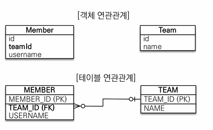
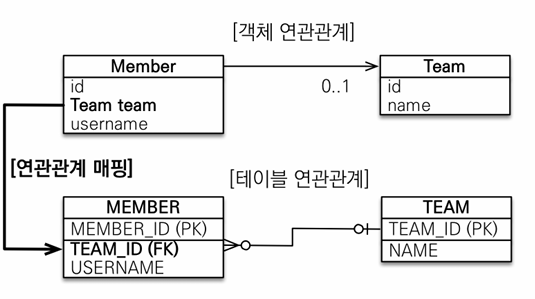
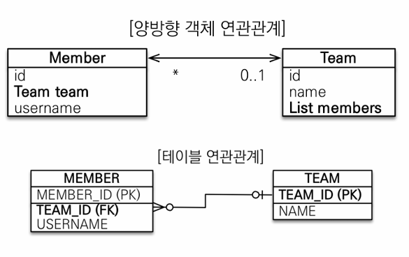

# 5. 연관 관계 매핑 기초
> ### 들어가기 전 알아야할 키워드
> 1. 방향(Direction)
>    - 단방향 : 한 방향으로만 참조(ex. 회원 객체 -> 팀 객체 또는 팀 객체 -> 회원 객체 중 하나만 참조)
>    - 양방향 : 양쪽 방향으로 참조(ex. 회원 객체 -> 팀 객체, 팀 객체 -> 회원 객체 둘다 참조)
>    - 단방향은 객체 관계에서만 존재, 테이블에서는 항상 양방향
> 2. 다중성(Multiplicity)
>    - N:1(다대일), 1:N(일대다), N:M(다대다)
>    - ex) 보통 회원과 팀의 관계가 있다고 하면
>      - N:1 : 회원과 팀, 여러 회원이 한팀에 속하므로
>      - 1:N : 팀과 회원
> 3. 연관관계의 주인(owner)
>     - 객체를 양방향 연관관계로 만들면 연관관계의 주인을 정해야한다.

## 1. 연관관계
예제 시나리오
- 회원과 팀이 있음
- 회원은 한 팀에만 소속될 수 있다.
- 회원과 팀은 다대일 관계이다.
 
위의 시나리오 대로 객체와 테이블을 각각 모델링하면 아래 처럼 나타낼 수 있다.



### 1-1. 순수 객체의 연관관계
순수하게 객체만 사용한 연관계를 살펴보고 이를 예시 코드로 만들어 보면 아래와 같다.
```java
// Member.java
@Getter
@NoArgsConstructor(access = AccessLevel.PROTECTED)
class Member {
   private long id;
   private long id;
   private String userName;
   private Team team;

   @Builder
   public Member(long id, String userName, Team team) {
       this.id = id;
       this.userName = userName;
       this.team = team;
   }
}

//Team.java
@Getter
@NoArgsConstructor(access = AccessLevel.PROTECTED)
public class Team {
   private Long id;
   private String name;

   @Builder
   public Team(Long id, String name) {
       this.id = id;
       this.name = name;
   }
}

//Main
public class Main {
   public static void main(String[] args){
       Team team1 = Team.builder()
         .id(1L).name("team1")
         .build();

       MemberCh05 member1 = MemberCh05
         .builder()
         .id(1L)
         .userName("member1")
         .team(team1)
         .build();

       MemberCh05 member2 = MemberCh05
         .builder()
         .id(2L)
         .userName("member2")
         .team(team1)
         .build();

       Team findTeam = member1.getTeam();    //객체 그래프 탐색
   }
}
```
- 회원 객체는 Member.team 필드로 팀 객체와 연관관계를 맺는다.
- 여기서 회원과 팀 객체는 단반향 관계로 member -> team이다. (그 반대는 불가능)
- 객체는 참조를 사용해서 연관관계를 탐색할 수 있는데 이를 객체 그래프 탐색이라고 한다.     
  위의 예시 코드에서는 `member1.getTeam();`이다.

### 1-2. 테이블에서의 연관관계


위의 테이블대로 연관관계를 만든다면 Member와 Team은 양방향 관계를 가진다.     
데이터 베이스는 외래키로 연관관계를 맺기 때문에 Join을 이용해 Member -> Team, Team -> Member 둘다 확인할 수 있다.

```sql
-- 회원1과 회원2을 team1에 소속 시키면
INSERT INTO TEAM(TEAM_ID, NAME) VALUES(1L, 'team1');
INSERT INTO MEMBER(MEMBER_ID, TEAM_ID, USERNAME)
VALUES (1L, 1L, 'member1'),
(2L, 1L, 'member2');

-- member1이 소속된 팀 구하기 -> 외래키로 탐색
SELECT T.*
FROM MEMBER M 
JOIN TEAM T ON M.TEAM_ID = T.ID
WHERE M.MEMBER_ID = 1L;

-- team1인 member 구하기 -> 외래키로 탐색
SELECT M.*
FROM MEMBER T 
JOIN TEAM M ON M.TEAM_ID = T.ID
WHERE T.ID = 1L;
```

### 1-3. 객체의 연관관계와 테이블 연관관계의 차이
- 객체 : 참조로 연관관계를 맺음(언제나 단반향)
- 테이블 : 외래 키로 연관관계를 맺음(양방향)
그래서 테이블에 맞춰서 데이터 중심으로 모델링하면 협력 관계를 만들기 힘들다.


## 2. 객체 관계 매핑(단방향 N:1)



위의 다이어그램처럼 회원을 팀으로 다대일 단방향 매핑을 하려면 아래처럼 team필드에 @ManyToOne과 @JoinColum 어노테이션을 추가해주면된다.

```java
//..
class Member {
    //...
  
  @ManyToOne
  @JoinColumn(name = "TEAM_ID")
  private Team team;
}
```
### 2-1. 매핑에 사용한 어노테이션
#### @ManyToOne
- 다대일 관계에서 사용

| 속성           | 기능                                                               | 기본값                                                             |
|--------------|------------------------------------------------------------------|-----------------------------------------------------------------|
| optional     | false로 설정하면 연관된 엔티티가 항상 있어야한다.                                   | true                                                            |
| fetch        | 글로벌 페치 전략 설정<br/>8장에서 다시 설명                                      | - @ManyToOne: FetchType.EAGER<br/> - @OonToMany: FetchType.LAZY |
| cascade      | 영속성 전의 기능<br/>8장에서 다시 설명                                         |                                                                 |
| targetEntity | 연관된 엔티티의 타입 정보를 설정<br/>거의 사용안됨<br/>컬렉션을 사용해도 제네릭으로 타입 정보를 알수 있다. |                                                                 |

- targetEntity 속성 예시 코드
```java
@OneToMany
private List<Member> members;   //제네릭으로 타입 정보를 알 수 있음

@OneToMany(targetEntity=Member.class)
private List members;   //제네릭이 없으면 타입 정보를 알 수 없다.
```


#### @JoinColumn
| 속성                      | 기능                                     | 기본값                                                                 |
|-------------------------|----------------------------------------|---------------------------------------------------------------------|
| name                    | 매핑할 외래키 이름                             | 필드명 + _ + 참조하는<br/>테이블의 기본 키 컬럼명<br/>위의 코드 예제에서는 team_TEAM_ID으로 나타냄 |
| referencedColumnName    | 외래키가 참조하는 대상 테이블의 컬럼명                  | 참조하는 테이블의 기본키 컬럼명                                                   |
| foreignKey(DDL)         | 외래키 제약조건을 직접 지정할 수 있음<br/>DDL 생성할때만 사용 |                                                                     |
| unique<br/>nuallable... | @Column의 속성과 같음                        |                                                                     |


### 2-2. CRUD 예제
#### 1. 저장 : 회원 엔티티는 팀 엔티티를 참조하고 저장함
```java
Team team1 = new Team("team1");
em.persist(team1);

Member member1 = new Member("member1");
member1.setTeam(team1);
em.persist(member1);

Member member2 = new Member("member2");
member2.setTeam(team1);
em.persist(member2);
```
- JPA는 참조한 팀의 식별자를 외래키로 사용해 적절한 insert 쿼리 만들어줌
```sql
INSERT INTO TEAM(TEAM_ID, NAME) VALUES (1L, 'team1');
INSERT INTO MEMBER(MEBMER_ID, NAME, TEAM_ID) VALUES (1L, 'member1', 1L);
INSERT INTO MEMBER(MEBMER_ID, NAME, TEAM_ID) VALUES (2L, 'member2', 1L);
```
#### 2. 조회
- 연관 관계가 있는 엔티티를 조회하는 방법은 크게 2가지이다.
  - 객체 그래프 탐색(객체 연관관계 사용한 조회)
  - 객체지향 쿼리 사용(JPQL)

1. 객체 그래프 탐색 : member.getTeam();을 사용해 조회(자세한 내용을 8장으로)
```java
Member member = em.find(Member.class, memberId);
Team team = member.getTeam();
System.out.println("team.getName() = " + team.getName());
```
2. 객체 지향 쿼리(JPQL) : 해당 내용은 10장에서
```java
String jpql = """
            select m from Member m
            join m.team t
            where t.name=:teamName
            """;

em.createQuery(jpql, Member.class)
      .setParameter("teamName", teamName)
      .getResultStream()
      .forEach(System.out::println);
```
```text
Hibernate: 
    /* select
        m 
    from
        Member m 
    join
        m.team t 
    where
        t.name=:teamName  */ select
            m1_0.MEMBER_ID,
            m1_0.TEAM_ID,
            m1_0.userName 
        from
            Member m1_0 
        join
            Team t1_0 
                on t1_0.TEAM_ID=m1_0.TEAM_ID 
        where
            t1_0.name=?
Hibernate: 
    select
        t1_0.TEAM_ID,
        t1_0.name 
    from
        Team t1_0 
    where
        t1_0.TEAM_ID=?
```

#### 3. 수정
```java
//새로운 팀
Team newTeam = new Team(newTeamName);
em.persist(newTeam);

//memberId인 회원에 새로운 팀2 설정
Member member = em.find(Member.class, memberId);
member.setTeam(newTeam);
```
- 참조하는 대상만 변경하면 JPA가 알아서 처리한다.

#### 4. 삭제
```java
Member member = em.find(Member.class, memberId);
member.setTeam(null);   //연관관계 시 제거 -> TEAM_ID = null
```
- 만약 team1 엔티티를 삭제하려면 연관 관계를 먼저 제거해줘야 한다.
- member1, member2의 team을  team1이 아닌 값으로 update -> team1을 삭제

## 3. 양방향 연관관계
단방향으로 매핑해 member -> team은 참조가 잘 된다. 하지만 만약 team -> member에 대한 참조가 필요하다면 어떻게 member에 대한 정보를 가져올까?  
테이블에서는 team -> member로 접근이 가능한데, 이를 객체에서 표현하려면 어떻게 해야될까?



위의 그림처럼 회원에서 팀으로, 팀에서 회원으로 모두 접근할 수 있게 `양방향으로 연관관계`를 매핑하면 된다.    
팀에서 회원은 일대다의 관계임으로 아래 코드와 같이 컬렉션을 사용하면 된다.     
```java
@OneToMany(mappedBy = "team")
private List<Member> members = new ArrayList<Member>();
```
- 컬렉션인 List<Member> members 추가
- 일대다 관계 @OneToMany 어노테이션 추가
  - mappedBy값으로 반대쪽 매핑의 필드 이름값을 지정해준다.

위에처럼 해주면 이제 팀에서 회원으로 그래프 탐색이 가능하다.
```java
Team team = em.find(Team.class, teamId);

System.out.println("[Info] pre get Members");
team.getMembers()   //team -> member로 객체 그래프 탐색
    .forEach(System.out::println);

//==결과==
//Member{id=1, userName='member1', teamName=team1}
//Member{id=2, userName='member2', teamName=team1}
```
### 3-1. 연관관계의 주인
사실 엄밀히 이야기하면 객체에서 양방향 연관관계는 없다. 단지 서로 다른 연관관계 2개를 애플리케이션 로직으로 묶어서 양방향인 것 처럼 보이게 한 것이다.     

- 데이터베이스
  - 회원 ↔ 팀의 연관관계 1개(양방향)
  - 외래키 하나로 두 테이블 연관관계를 관리
- 객체
  - 단방향 연관관계 2개
    - 회원 → 팀 연관관계 1개(단방향)
    - 팀 → 회원 연관관계 1개(단방향)

문제는 엔티티를 양방향으로 연관관계를 설정하면 객체 참조는 둘인데 외래키(테이블에서)는 하나라서 여기에 대한 차이가 발생한다.     
그래서 두개의 연관관계 중 하나를 정해 테이블의 외래키를 관리해야한다. 그리고 이 외래키를 관리하는 객체가 바로 연관관계의 주인(Owner)이다.

### 3-2. 양방향 매핑의 규칙 : 연관관계의 주인
양방향 연관관계 매핑 시 지켜야할 규칙
- 두 연관관계 중 하나를 연관관계의 주인으로 정해야한다.
- 이 연관관계의 주인만이 데이터베이스 연관관계와 매핑되고 외래키를 관리(등록, 수정, 삭제)를 할 수 있다.
- 반면에 주인이 아닌쪽은 읽기만 가능하다.
- 주인 선택은 mappedBy속성을 사용한다.
- 주인이 아닌쪽에 mappedBy속성을 사용해 속성의 값으로 연관관계의 주인을 지정한다.

주인 선택
- **연관관계의 주인을 정한다는 것은 사실 외래키 관리자를 선택하는 것**
- 예제에서는 TEAM_ID 외래키를 관리하는 관리자를 선택해야한다. -> Member.team를 주인으로 선택한다.
  - 만약 Member.team을 주인으로 선택 -> 자기 테이블의 외래키 관리
  - 만약  Team.members을 주인으로 선택 -> 물리적으로 전혀 다른 테이블의 외래키를 관리해야함(team엔티티는 TEAM테이블에 매핑되어 있는데 관리해야할 외래키는 다른 테이블(MEMBER)에 있음)
- 즉 보통 외래키가 있는 쪽을 주인으로 선택하면 된다.

> 참조
> 데이테베이스 테이블의 다대일, 일대다 관계에서는 항상 다 쪽이 외래키를 가진다.    
> 다 쪽인 @ManyToOne은 항상 연관관계의 주인이라서 mappedBy 설정을 할 수 없어서 해당 속성이 없다.


## 4. 양방향 연관관계의 주의점
### 4-1. 양방향 연관관계 저장
- 단방향 연관관계 저장하는 코드와 동일
- 양방향 연관관계는 주인이 외래키를 관리해서 주인이 아닌 방향은 값을 설정하지 않아도 데이터베이스에 외래키값이 정상 입력된다.
- 만약 Team.members처럼 주인이 아닌 곳에서 입력된 값을 저장하려고 하면 데이터베이스에 저장할때 무시한다.
  - `team1.getMembers().add(new Member("new Member")); //무시함`

### 4-2. 양방향 연관관계의 주의점
가장 흔히 하는 실수는 연관관계의 주인에는 값을 입력하지 않고 주인이 아닌 곳에만 값을 입력하는 것이다.     
만약 DB에 외래키 값이 정상적으로 저장되지 않으면 해당부분을 의심해라.
```java
Member member1 = new Member("member1_nonOwner");
em.persist(member1);

Member member2 = new Member("member2_nonOwner");
em.persist(member2);

Team team = new Team("team_nonOwner");

//주인이 아닌 곳만 연관관계 설정
team.getMembers().add(member1);
team.getMembers().add(member2);

em.persist(team);
```
- 해당 결과 보면 저장된 member의 외래키가 null로 저장되는 것을 볼 수 있다.
- `외래키 주인만이 외래키의 값을 변경할 수 있다!!!`

#### 4-2-1. 순수한 객체까지 고려한 양방향 관계
주인에만 값을 저장하고 주인이 아니 곳에서 값을 저장하지 않아도 될까...?     
사실 객체 관점에서 양쪽 방향에 모두 값을 입력해주는 것이 안전하다. 양쪽 방향 모두 값을 입력하지 않으면 JPA를 사용하지 않는 순수한 객체 상태에서 심각한 문제가 발생할 수 있기 때문이다.
```java
public void 순수한객체_양방향_설정_주인만() {
    Team team1 = new Team("team1");
    Member member1 = new Member("member1");
    Member member2 = new Member("member2");

    //연관관계 설정 member -> team
    member1.setTeam(team1);
    member2.setTeam(team1);

    List<Member> members = team1.getMembers();
    System.out.println("members.size() = " + members.size());

    //실행 결과 members.size() = 0
}

/**
 * 위에서 실행 결과는 우리가 원하는 양방향 관계의 결과가 아님
 * 그래서 회원 -> 팀을 설정하려면 팀 -> 회원도 설정(양쪽다 관계를 설정)
 */
public void 순수한객체_양방향() {
    Team team1 = new Team("team1");
    Member member1 = new Member("member1");
    Member member2 = new Member("member2");
    
    //연관관계 설정 member -> team
    member1.setTeam(team1);
    member2.setTeam(team1);
    
    //team -> member
    team1.getMembers().add(member1);
    team1.getMembers().add(member2);
    
    List<Member> members = team1.getMembers();
    System.out.println("members.size() = " + members.size());
    
    //실행 결과 members.size() = 2
}
```
jpa
```java
public void testORM_양방향() {
    bem.execute(em -> {
        Team team1 = new Team("team1");
        em.persist(team1);


        Member member1 = new Member("member1");
        //양방향 관계 설정
        member1.setTeam(team1);     //연관관계 주인, 이 값으로 외래키 관리
        team1.getMembers().add(member1);    //연관관계 주인X, 따라서 저장시에는 사용되지 않음
        em.persist(member1);


        Member member2 = new Member("member2");
        //양팡방 관계 설정
        member2.setTeam(team1);
        team1.getMembers().add(member2);
        em.persist(member2);

    });
}
```
#### 4-2-2. 연관관계 편의 메서드 및 작성 시 주의 사항
양방향 연관관계는 실수로 둘중 하나만 설정해서 양방향이 깨질 수 있기 때문에 결국 양쪽다 신경써야된다.     
그래서 하나인 것 처럼 사용하는 것이 좋다.
```java
public void setTeam(Team team) {
    this.team = team;
    team.getMembers().add(this);
}
//그래서 양방향 메서드를 리팩터링 하면 
public void testORM_양방향() {
    Team team1 = new Team("team1");
    em.persist(team1);


    Member member1 = new Member("member1");
    member1.setTeam(team1);
    em.persist(member1);


    Member member2 = new Member("member2");
    member2.setTeam(team1);
    em.persist(member2);
}
```
사실 위의 코드도 버그가 있다.
```java
member1.setTeam(teamA);
member1.setTeam(teamB);
List<Member> members = teamA.getMembers(); // 여전히, member1를 조회
```
teamB로 변경할 때 teaA-> member1관계를 제거하지 않아서 여전히, member1를 조회한다.     
그래서 기존팀과 회원의 연관관계를 삭제하는 코드를 추가해야한다.     
```java
public void setTeam(Team team) {
    //기존 팀과 관계를 제거
    if (this.team != null) {
        this.team.getMembers().remove(this);
    }
    this.team = team;
    team.getMembers().add(this);
}
```

> 양방향 맵핑시 무한 루프에 빠지지 않게 조심
> - Member.toString()에서 getTeam() 호출하고 Team.toString()에서 getMembers() 호출하면 무한 루프에 빠질 수 있다.
> - 이런 문제는 JSON으로 변환할 때 자주 발생
> - JSON 라이브러리들은 보통 무한루프에 빠지지 않도록하는 어노테이션이나 기능을 제공
> - lombok라이브러리 사용할 때도 자주 발생
