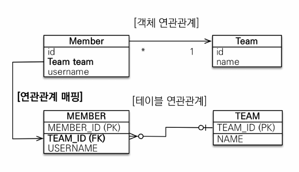
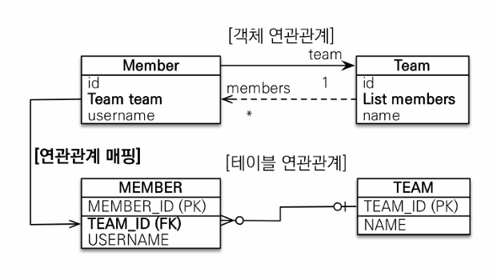
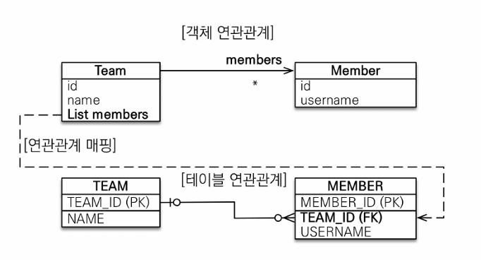
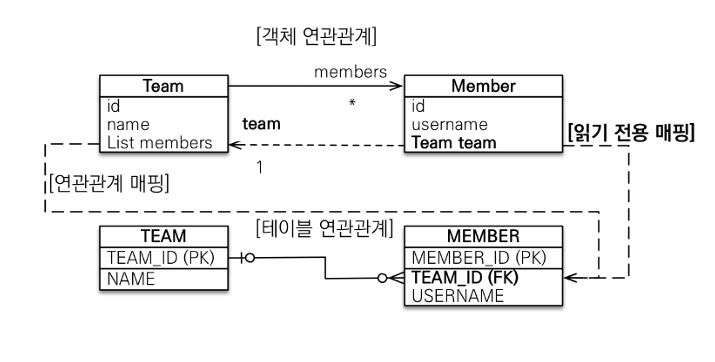
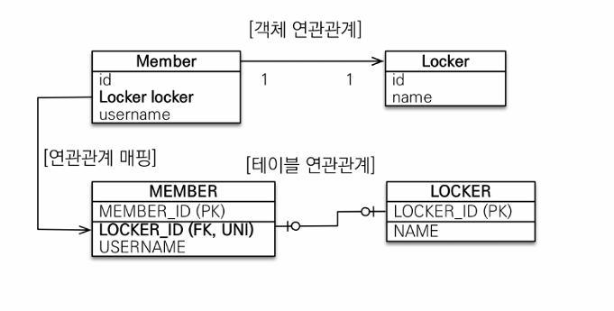
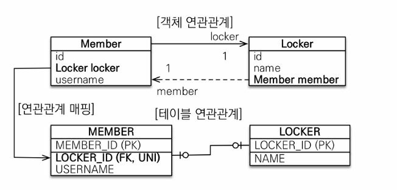
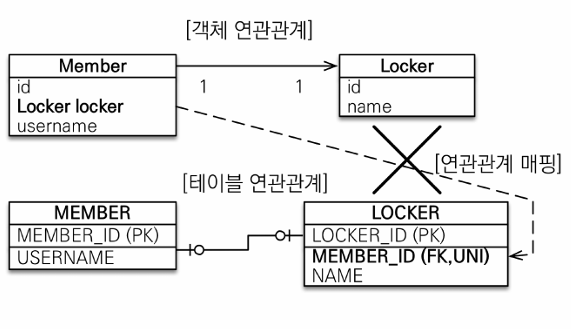
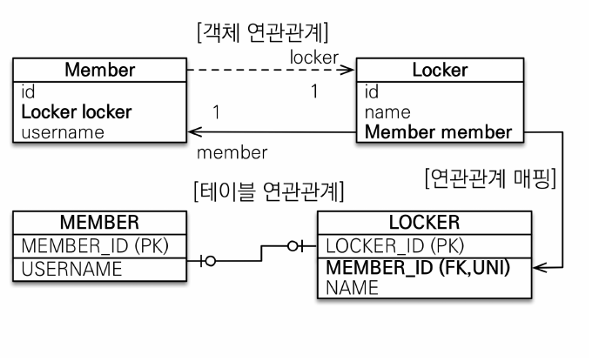
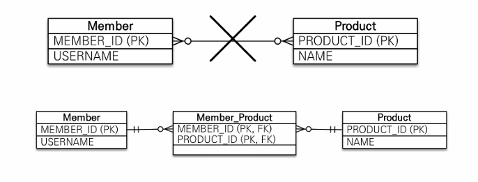
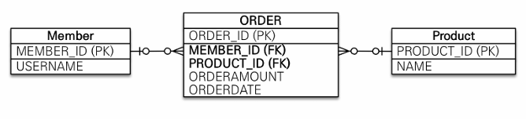

# 6장 다양한 연관관계 매핑
## 1. 다대일(N:1)
- 다대일의 반대는 일대다, 일대다의 반대는 다대일
- 데이터베이스 테이블에서 항상 1:N 관계에서 항상 N에 외래키가 있음
### 1-1. 다대일 단방향



```java
@Entity
public class Member {

    @Id
    private Long id;

    private String name;

    @ManyToOne
    @JoinColumn(name = "TEAM_ID")
    private Team team;
}
```
- 단순히 Member엔티티에 team을 추가하고 `@ManyToOne @JoinColumn(name = "TEAM_ID")` 지정
- 단방향임으로 팀에서 회원을 참조하는 필드는 필요 없음
- `TEAM_ID` 외래키 관리를 Member.team으로 관리
### 1-2. 다대일 양방향



- 실선(Member.team)이 연관관계 주인, 점선(Team.member)은 연관관계의 주인이 아니다.

```java
@Entity
public class Member {

    @Id
    private Long id;

    private String name;

    @ManyToOne
    @JoinColumn(name = "TEAM_ID")
    private Team team;

    //==  연관 편의 메소드 ==//
    public void setTeam(Team team) {
        //무한 루프에 빠지지 않도록 주의
        if (this.team != null) {
            this.team.getMembers().remove(this);
        }
        this.team = team;
        this.team.getMembers().add(this);
    }
}

@Entity
@Getter
public class TeamTemp {
    @Id
    private Long id;

    private String name;
    
    //N:1 양방향
    @OneToMany(mappedBy = "team")
    private List<MemberTemp> members;
}
```
- 양뱡향은 외래키가 있는쪽이 연관관계 주인(N쪽에 외래키가 있음)
- 양방향 연관관계는 항상 서로를 참조
    - 편의 메소드를 작성하는 것이 좋다.
    - 편의 메소드는 한곳에만 작성하거나 양쪽다 작성할 수 있는데, 양쪽다 작성하는 경우 무한루프에 빠지지 않도록 주의해야함

## 2. 일대다(1:N)
- 일대다는 다대일의 반대 방향
- 일이 연관관계 주인이지만, 테이블의 FK는 다쪽에 있다.

### 2-1. 일대다 단방향



- 엔티티 Team.members로 회원 테이블의 TEAM_ID 외래키 관리
- 보통 자신이 매핑한 테이블의 외래키를 관리하는데, 이 매핑은반대쪽 테이블에 있는 외래키 괸리(특이)
```java
@Entity
@Getter
public class Team {

    @Id
    private Long id;

    private String name;
    
    //1:N
    @OneToMany
    @JoinColumn(name = "TEAM_ID")  // member 테이블의 team_id(fk),
    private List<Member> members = new ArrayList<>();
}
```
- 일대다 단반향 관계를 매핑할 때는 `@JoinColumn`을 명시해야함
- `@JoinColumn`을 명시하지 않으면 JPA는 `연결 테이블`을 생성해 중간에 두고 연관관리를 관리하는 조인 테이블 전략을 기본으로 사용해 매핑함
    - Team과 Member의 pk값을 가지는 연결테이블 생성
- 외래키가 다른 테이블에 있어서 Insert 쿼리를 날릴 경우 update 쿼리가 추가로 실행됨
- 일대다 단방향 매핑 보다는 다대일 양방향 매핑을 사용하자!
    - 성능(update 쿼리가 추가로 발생..)의 문제
    - 관리의 문제

### 2-2. 일대다 양방향
- 일대다 양방향 매핑은 존재하지 않음
- DB 특성상 다대일 관계에서 항상 다쪽에 외래키가 있기 때문에 양방향 매핑에서 @OneToMany는 연관관계의 주인이 될 수 없다.
- 불가능 한 것은 아니지만, 최대한 다대일 양방향 매핑을 사용하자



```java
@Entity
@Getter
public class Team {

    @Id
    private Long id;

    private String name;

    //1:N
    @OneToMany
    @JoinColumn(name = "TEAM_ID")  // member 테이블의 team_id(fk),
    private List<Member> members = new ArrayList<>();
}

@Entity
public class Member {

    @Id
    private Long id;

    private String name;

    @ManyToOne
    @JoinColumn(name = "TEAM_ID",
        insertable = false, updatable = false
    )
    private Team team;

    //setter, getter...
}
```
- @JoinColumn 속성의 insertable과 updatabler 값을 false로 설정하면 일기 전용으로 되어 양방향처럼 보이게 할 수는 있음

## 3. 일대일(1:1)
- 양쪽이 서로 하나의 관계만 가짐
- 일대일 관계에선는 주 테이블(주로 사용되는 테이블이라고 생각하면됨)이나 대상 테이블 둘중 어느 곳이나 외래키를 가질 수 있음
- 주 테이블에 외래키
    - 주 객체가 대상 객체를 참조하는 것 처럼 주 테이블에 외래키를 두고 대상 테이블을 참조
    - 외래키를 객체 참조와 비슷하게 사용할 수 있어서 객체지향 개발자들이 선호
    - 주테이블만 확인해도 대상 테이블과 연관관계가 있는지 알 수 있음
- 대상 테이블에 외래키
    - DBA분들이 보통 선호
    - 테이블 관리를 일대일에서 일대다로 변경할 때 테이블 구조를 그대로 유지할 수 있음

### 3-1. 주 테이블에 외래 키
#### 단방향



```java
@Entity
public class Member {
    @Id
    private Long id;

    private String name;

    //1:1 (주테이블에 외래키)
    @OneToOne
    @JoinColumn(name = "LOCKER_ID")
    private Locker locker;
    
}

@Entity
public class Locker {
    @Id
    private Long id;
    private String name;
}
```
- @OneToOne을 사용하고 주테이블에 @JoinColumn(name = "LOCKER_ID")으로 외래키 지정

#### 양방향



```java
@Entity
public class Member {
    @Id
    private Long id;

    private String name;
    
    @OneToOne
    @JoinColumn(name = "LOCKER_ID")
    private Locker locker;
    
}

@Entity
public class Locker {
    @Id
    private Long id;
    private String name;

    @OneToOne(mappedBy="locker")
    private List<Member> members;
}
```

### 3-2. 대상 테이블에 외래 키
#### 단방향



- `대상 테이블에 외래키가 있는 단방향 관계는 JPA에서 지원하지 않는다.`
- 매핑할 수 있는 방법이 없다.
- 이럴때는 단방향 관계를 Locker에서 Member방향으로 수정하거나
- 양방향 관계로 만들고 Locker를 연관관계의 주인으로 설정

#### 양방향



- 대상 태이블에 외래키가 있을 경우 단방향을 JPA에서 지원하지 않기 때문에 양방향 매핑을 해야한다.

```java
@Entity
public class Member {
    @Id
    private Long id;

    private String name;
    
    @OneToOne(mappedBy="members")
    private Locker locker;
    
}

@Entity
public class Locker {
    @Id
    private Long id;
    private String name;

    @OneToOne()
    @JoinColumn(name = "MEMBER_ID")
    private List<Member> members;
}
```
- 프록시를 사용할 때 외래키를 직접 관리하지 않는 일대일 관계는 지연 로딩으로 설정해도 즉시 로딩된다.
- 즉 Locker.members는 지연로딩할 수 있지만, Member.locker는 지연로딩으로 설정해도 즉시 로딩됨
- 프록시의 한계 때문에 발생한 문제이다.
- 프록시 대신 bytecode instrumentation을 사용하면 해결 할 수 있지만 설정이 어렵다고 한다.

## 4. 다대다(N:M)
- 관계형 데이터베이스 정규화된 테이블을 2개로 다대다 관계를 표현할 수 없다.
- 보통 그래서 다대다를 다대일, 일대다 관계로 풀어내는 연결 테이블을 사용한다.

- 예제
    - 회원들이 상품을 주문한다.
    - 상품들은 회원들에 의해 주문된다.



- 다대다가 불가능해 위의 그림처럼 중간에 연결 테이블을 만들어주어야한다.
- 하지만 객체의 경우 다대다 관계를 만들 수 있다.(컬랙션 사용으로)

### 4-1. 다대다 단방향

```java
@Entity
public class Member {

    @Id
    private Long id;

    private String name;

    //N:M -> 연결 테이블을 만듬
    @ManyToMany
    @JoinTable(name = "MEMBER_PRODUCT", //연결 테이블 이름 지정
        joinColumns = @JoinColumn(name = "MEMBER_ID"),  //현재 방향이 회원과 맵핑할 조인 컬럼 정보
        inverseJoinColumns = @JoinColumn(name = "PRODCUT_ID")   //반대방향인 상품과 매핑할 조인 컬럼 정보
    )
    private List<Product> products = new ArrayList<>();
    //...
}
@Getter
@Entity
public class Product {

    @Id
    private Long id;
    private String name;
    
    //...
}
```
- @ManyToMany, @JoinTable을 사용해 연결 테이블을 바로 맵핑한 것
- MemberProduct 엔티티 없이 바로 매핑 완료
- 저장하면
```java
public void save() {
    Product productA = new Product(1L, "productA");
    em.persist(productA);
    
    Member member1 = new Member(1L, "member1");
    member1.getProducts().add(productA);
    em.perist(member1);
}
```
```sql
INSERT INTO PRODUCT ...
INSERT INTO MEMBER ...
INSERT INTO MEMBER_PRODUCT ...
```
- 탐색하면
```java
public void find() {
    Member member = em.find(Mebmer.class, 1L);
    List<Product> products = member.getProducts();  //객체 그래프 탐색
}
```
```sql
-- member.getProducts();을 하면 아래 sql이 실행
-- MEMBER_PRODUCT와 상품 테이블을 조인해서 상품을 조회
SELECT * FROM MEMBER_PRODUCT MP
INNER JOIN PRODUCT P ON MP.PRODUCT_ID = P.PRODUCT_ID
WHERE MP.MEBMER_ID=?
```

### 4-2. 다대다 양방향
```java
@Getter
@Entity
public class Product {

    @Id
    private Long id;
    private String name;
    
    //...

    // N:M 양방향
    @ManyToMany(mappedBy = "products") //역방향 추가
    private List<MemberTemp> members = new ArrayList<>();
}

@Entity
public class Member {
    //...

    // 편의 메소드 추가
    public void addProduct(Product p) {
      products.add(p);
      p.getMembers().add(this);
    }
}

```
- mappedBy로 연관관계 주인 지정

### 4-3. 다대다의 한계(1:N, N:1 관계로 풀어내기)
- 연결 테이블을 자동으로 처리해주긴 하지만, 실무에서 사용하기에는 한계가 있음
- 보통 createDate, updateDate, 수량.. 등 여러 컬럼들이 더 필요하기 때문
- 그래서 N:M 관계를 1:N, N:1 관계로 풀어서 사용하는 것을 추천한다.



```java
@Entity
public class Member {
  @Id
  private Long id;

  private String name;

  // n:m - > 1: n : 1 관계로 퓰기
  @OneToMany(mappedBy = "member") //주인으로 하기 힘드니 역방향으로(양방향으로 풀기)
  private List<Order> orders;

}
@Entity
@Table(name ="ORDERS")
//@IdClass(OrderId.class)   //복합키 사용시
public class Order {

  @Id //대리키, 복합키 사용시 해당 필드 삭제
  private Long id;

  //    @Id //복합키 사용시
  @ManyToOne
  @JoinColumn(name = "mebmer_id")
  private Member member;

  //    @Id //복합키 사용시
  @ManyToOne
  @JoinColumn(name = "product_id")
  private Product product;

  private LocalDateTime update;
}

public class OrderId implements Serializable {

  private Long member;
  private Long product;

  //hasCode and equals
  @Override
  public boolean equals(Object obj) {
    //...
  }

  @Override
  public int hashCode() {
    //...
  }
}

```
- Member와 Orders는 양방향 관계로, Order와 Product는 단방향으로 만들었다.
- Order의 식별자를 복합키(member_id, product_id)로 사용할 때는 아래 방식을 사용한다.(7장에서 다시 자세히 다룸)
    - @IdClass을 이용해 식별자 클래스을 사용한다.
        - 복합키는 별도의 식별자 클래스로 만들어야한다.
        - Serializable을 구현해야한다.
        - equals, hashCode 메소드 구현
        - 기본 생성자 있어야한다.
        - 식별자는 public
    - @EmbeddedId를 사용하는 방법도 있다.
- 하지만 복합키 말고 대리키(대체키)를 사용하는 것을 권장한다.

#### 4-3-1. 대리키 사용(식별관계, 비식별 관계)
- 식별 관계 : 받아온 식별자를 기본키 + 외래키로 사용
- 비식별 관계 : 받아온 식별자는 외래키로만 사용하고, 새로운 식별자를 추가함
- 식별 관계 보다는 비식별 관계를 추천(단순해서)

