# ch7. 고급 매핑
<!-- TOC -->
* [1. 상속 관계 매핑](#1-상속-관계-매핑)
  * [1-1. 조인 전략](#1-1-조인-전략)
  * [1-2. 단일테이블 전략](#1-2-단일테이블-전략)
  * [1-3. 구현 클래스마다 테이블 전략](#1-3-구현-클래스마다-테이블-전략)
* [2. @MappedSuperclass](#2-mappedsuperclass)
* [3. 복합 키와 식별관계 매핑](#3-복합-키와-식별관계-매핑)
  * [3-1. 식별 관계 vs 비식별 관계](#3-1-식별-관계-vs-비식별-관계)
    * [식별 관계](#식별-관계)
    * [비식별 관계](#비식별-관계)
    * [식별 vs 비식별](#식별-vs-비식별)
  * [3-2. 복합키 : 비식별 관계 매핑](#3-2-복합키--비식별-관계-매핑)
  * [3-3. 복합키 : 식별 관계 매핑](#3-3-복합키--식별-관계-매핑)
  * [3-4 복합키 식별 관계 -> 식별 관계로 변경](#3-4-복합키-식별-관계---식별-관계로-변경)
  * [3-5 일대일 식별 관계](#3-5-일대일-식별-관계)
  * [3-6 식별, 비식별 장단점](#3-6-식별-비식별-장단점)
* [4. 조인 테이블](#4-조인-테이블)
  * [4-1. 일대일 조인 테이블](#4-1-일대일-조인-테이블)
  * [4-1. 일대다 조인 테이블](#4-1-일대다-조인-테이블)
  * [4-2. 다대일 조인 테이블](#4-2-다대일-조인-테이블)
  * [4-3. 다대다 조인 테이블](#4-3-다대다-조인-테이블)
* [5. 에티티 하나에 여러 테이블 매핑(@SecondaryTable)](#5-에티티-하나에-여러-테이블-매핑secondarytable)
* [6. 실전 예제](#6-실전-예제)
  * [요구사항 및 설계](#요구사항-및-설계)
  * [구현 코드](#구현-코드)
<!-- TOC -->

## 1. 상속 관계 매핑
- 관계형 데이터베이스에는 상속이라는 개념이 없다. 대신에 슈퍼타입 서브타입 관계라는 모델링 기법이 객체의 상속 개념과 유사하다.
- ORM에서 이야기하는 상속 관계 매핑은 데이터베이스의 슈퍼타입 서브타입 관계를 매핑하는 것이다.
- 슈퍼타입 서브타입 논리모델을 물리 모델인 테이블로 구현하는 전략에는 다음과 같이 있다.
  1. 각각의 테이블로 변환(조인)
  2. 통합 테이블로 변한(단일테이블)
  3. 서브타입 테이블로 변환 

### 1-1. 조인 전략
- 각각의 테이블로 변환하는 방법
- 엔티티를 모두 테이블로 만들고, 자식테이블이 부모 테이블의 기본 키를 받아 기본 키 + 외래 키로 사용하는 전략
- 설계의 입장에서도 가장 정석적인 방법이다.
- 주의할 점 : 타입을 구분하는 커럼을 추가(DTYPE 컬럼)

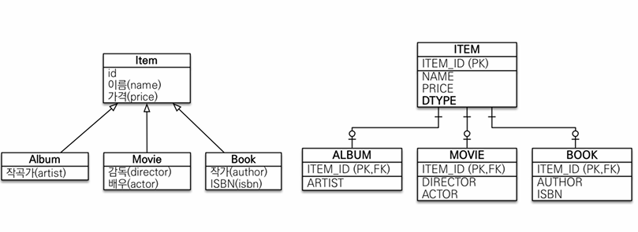

```java

@Entity
@Inheritance(strategy = InheritanceType.JOINED) //join 전략
@DiscriminatorColumn(name = "DTYPE")    //DTYPE(디폴트) name으로 디폴트값으로..
public abstract class Item extends BaseEntity {
  //abstract 클래스로 만들어야됨
    
    @Id @GeneratedValue
    private Long id;

    private String name;

    private int price;
    
    //getter setter ...
}

@Getter
@Setter
@Entity
@DiscriminatorValue("A")    // 설정안하면 기본값으로 클래스 네임으로 들어감(여기선 Movie)
@PrimaryKeyJoinColumn(name = "MOVIE_ID")
public class Movie extends Item{
    private String director;
    private String actor;
}

@Getter
@Setter
@Entity
public class Album extends Item{
    private String artist;
}

@Getter
@Setter
@Entity
public class Book extends Item{
    private String author;
    private String isbn;
}
```

- @Inheritance(strategy = InheritanceType.JOINED)
  - 상속 매핑 부모 클래스에 사용
  - 매핑 전략 선택 : JOINED
- @DiscriminatorColumn
  - 부모 클래스에 구분 컬럼 지정
  - 기본값이 DTYPE
  - 컬럼명을 지정하고 싶으면 name 속성으로 지정
- @DiscriminatorValue("A")
  - 엔티티 저장할 때 구분 컬럼에 입력할 값
  - 위의 코드에서 영화 엔티티 저장시 Item 테이블에 DTYPE값이 "A"로 들어간다.
  - 기본 값은 클래스 명으로 들어간다.(지정 안하면 영화는 "Movie"로 들어간다.)
- @PrimaryKeyJoinColumn(name = "MOVIE_ID")
  - 원래 서브타입 PK가 기본값으로 부모테이블 ID 컬럼명을 그대로 사용하는데, 자식 테이블 기본 키 컬럼명을 바꾸고 싶으면 사용한다.
  - 위에선는 MOVIE 테이블의 기본 키 값은 ITEM_ID가 아니라 "MOVIE_ID"로 들어간다.
  

#### 장점 및 단점
장점
- 데이터 정규화
- 외래 키 참조 무결성 제약조건 활용 가능
- 저장공간 효율적 사용

단점
- 조회할 때 조인 많이 사용되어서 성능이 저하될 수 있음
- 조회 쿼리가 복잡
- 저장 시 insert 쿼리를 2번 날린다.

### 1-2. 단일테이블 전략
- 하나의 테이블에 다 넣는 전략
- 구분 컬럼(DTYPE)로 자식 데이터가 저장되었는지 구분
- 조회할 때 가장 빠름
- @Inheritance 전략의 기본값이다.(InheritanceType.SINGLE_TABLE)


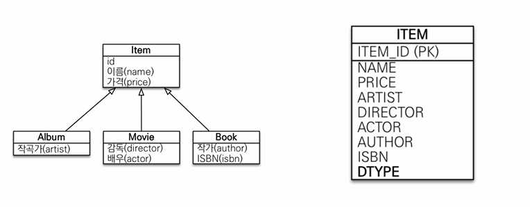

```java
@Entity
@Inheritance(strategy = InheritanceType.SINGLE_TABLE)   //성능상 이점이 있음
@DiscriminatorColumn    //해당 어노테이션 없어도 DTYPE 들어감
public abstract class Item extends BaseEntity {
  //abstract 클래스로 만들어야됨
    
    @Id @GeneratedValue
    private Long id;

    private String name;

    private int price;
    
    //getter setter ...
}

@Getter
@Setter
@Entity
public class Movie extends Item{
    private String director;
    private String actor;
}

@Getter
@Setter
@Entity
public class Album extends Item{
    private String artist;
}

@Getter
@Setter
@Entity
public class Book extends Item{
    private String author;
    private String isbn;
}
```
- 자식 엔티티가 매핑한 컬럼은 모두 null을 허용애햐한다. (Album 엔티티를 저장하면 다른 엔티티의 필드값들은 null이 입력)
- 구분 컬럼을 필수로 사용해야한다. (그래서 @DiscriminatorColumn 없어도 알아서 DTYPE 들어감)


#### 장점 및 단점
장점
- 조인이 필요 없다(조회 성능이 빠르다)
- 조회 쿼리가 단순하다.

단점
- 자식 엔티티가 매핑한 컬럼은 모두 null 허용해야함
- 단일 테이블에 모든 것을 저장해 테이블이 커질 수 있음. 상황에 따라 조회 성능이 안 좋아질 수 도 있음(이 경우 한계점에 도달해야하는데 거의 그럴일 없음)

### 1-3. 구현 클래스마다 테이블 전략
- 자식 엔티티마다 테이블을 만든다.(부모 엔티티는 테이블을 생성 안함)
- 자식 테이블 각각에 필요한 컬럼이 모두 있음

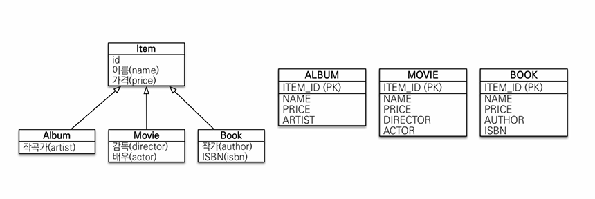

```java
@Inheritance(strategy = InheritanceType.TABLE_PER_CLASS)
@Getter
@Setter
@Entity
public abstract class Item extends BaseEntity {
    @Id @GeneratedValue
    private Long id;

    private String name;

    private int price;
}
```
- 아이템 테이블 없애고 자식 클래스 테이블만 생성 (대신 아템 테이블의 속성값을 가짐)
- DBA, ORM 전문가 둘 다 추천하지 않는 전략

#### 장점과 단점
장점
- 서브 타입을 구분해서 처리할 때 효과적
- not null 제약조건을 사용할 수 있음

단점
- 여러 자식 테이블을 함께 조회할 때 성능이 느림(UNION을 사용함)
- 자식 테이블을 통합해서 쿼리하기 어려움

## 2. @MappedSuperclass
- 테이블은 만들지 않고 공통의 매핑 정보가 필요할 때 사용
- 속성만 상속해서(테이블은 완전 다른데 속성만 쓰고 싶으면) 사용
- 상속관계 매핑, 엔티티, 테이블이 아니다. 단순히 매핑 정보만 제공한다.
- 조회나 검색이 불가하다.(find, JPQL에서 사용 불가)
- 직접 생성해서 사용할 일이 없어 추상클래스로 구현할 것을 권장한다.
- 보통 생성일, 생성자, 수정자, 수정일 등 같은 곳에 사용한다.
```java
@MappedSuperclass
public abstract class BaseEntity {
    private String createBy;
    private LocalDateTime createdAt;
    private String updatedBy;
    private LocalDateTime updatedAt;
}

//사용
@Entity
public abstract class Item extends BaseEntity {

    @Id
    @GeneratedValue
    private Long id;
    //...
}
```

## 3. 복합 키와 식별관계 매핑
### 3-1. 식별 관계 vs 비식별 관계
데이터베이스 테이블 사이의 관계는 외래 키가 기본 키에 포함되는지 여부에 따라 나눠진다.(식별, 비식별)

#### 식별 관계

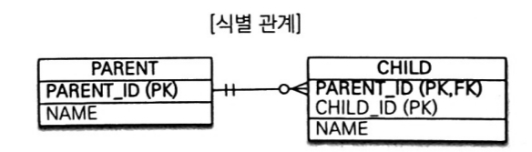

- `부모 테이블의 기본 키`가 자식 `테이블의 PK + FK`로 사용하는 관계 
- 위의 ERD를 보면 CHILD 테이블이 PARENT 테이블의 기본 키 PARENT_ID를 받아서 PK + FK로 사용하는 것을 볼 수 있다.

#### 비식별 관계

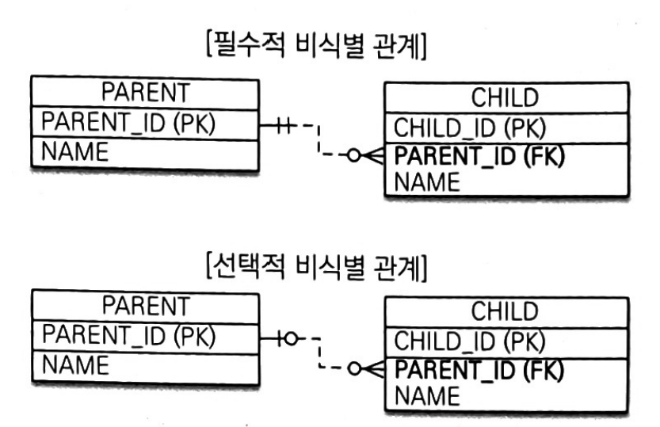

- `부모 테이블의 기본 키`를 `자식 테이블의 외래 키로만` 사용
- 비식별 관계를 외래 키에 NULL을 허옹하는지에 따라 나눠짐
  - 필수적 비식별 관계(Mandatory)
    - 외래 키에 NULL을 허용하지 않는다.
    - 연관관계를 필수적으로 맺어야함
  - 선택적 비식별 관계(Optional)
    - 외래 키에 NULL을 허용
    - 연관관계를 맺을지 선택할 수 있음

#### 식별 vs 비식별
- 비식별을 사용하고 꼭 필요한 곳에만 식별 관계를 사용


### 3-2. 복합키 : 비식별 관계 매핑
- JPA에서는 영속성 컨텍스트에서 엔티티의 식별자를 키로 사용해서 식별자를 구분한다. 그래서 복합키를 사용하려면 식별자 구분을 위해 별도의 식별자 클래스를 구현해야 한다.
- 식별자 구분을 위해 식별자 클래스에 equals와 hashCode로 식별자늘 구분할 수 있게 구현해야한다.
- 복합키를 사용할 때 방법 2가지
  - @IdClass
    - 식별자 클래스 매핑
    - 관계형 데이터베이스에 가까운 방법
  - @EmbeddedId
    - 객체지향에 가까운 방법
    - 엔티티 식별자 값으로 식별자 클래스로 사용하고 @EmbeddedId어노테이션 사용
    - 식별자 클래스에 @Embeddable어노에이션 사용
    
- 복합키에는 @GenerateValue를 사용할 수 없다!!!


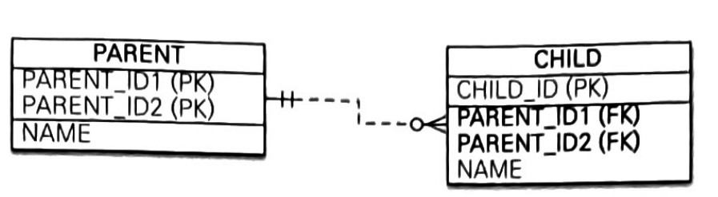

- ERD를 보면 부모 테이블이 복합키를 가지고 있다 -> 식별 클래스를 구현해야한다.
- 자식 클래스는 부모 테이블의 복합키를 외래키로 가지고 있다.
- ERD를 보고 이제 각각 @IdClass와 @EmbeddedId로 구현해보겠ㄷ.

#### @IdClass
```java

@Entity
@IdClass(ParentId.class)
public class Parent {

    @Id
    @Column(name = "PARENT_ID1")
    private Long id1;
  
    @Id
    @Column(name = "PARENT_ID2")
    private Long id2;
  
    private String name;
}

@ToString
@Getter
@Entity
public class Child {

    @Id
    private Long id;
  
    private String name;
  
    @ManyToOne
    @JoinColumns({
            @JoinColumn(name = "PARENT_ID1",
                    referencedColumnName = "PARENT_ID1"),
            @JoinColumn(name = "PARENT_ID2",
                    referencedColumnName = "PARENT_ID2")
    })
    private Parent parent;
    
}

public class ParentId implements Serializable {

    private Long id1;   //Parent.id1 매핑
    private Long id2;   //Parent.id2 매핑

    public ParentId() {
    }

    public ParentId(Long id1, Long id2) {
        this.id1 = id1;
        this.id2 = id2;
    }
    //hashCode, equals
}
```
@IdClass 사용시 식별자 클래스 조건
- Serializable 인터페이스 구현해야함
- equals, hashCode 구현
- 기본 생성자 있어야함
- 식별자 클래스는 public 이어야함


#### @EmbeddedId

```java
@Entity
public class Parent {
  @EmbeddedId
  private ParentId id;

  private String name;

  public Parent(String name) {
    this.name = name;
  }

  public Parent() {
  }
}

@Embeddable
public class ParentId implements Serializable {

    @Column(name = "PARENT_ID1")
    private Long id1;   //Parent.id1 매핑

    @Column(name = "PARENT_ID2")
    private Long id2;   //Parent.id2 매핑
//hashcode,equals
}

```
@EmbeddedId 사용시
- 식별자 클래스에 @Embeddable 어노테이션을 붙여줘야한다.
- Serializable인터페이스 구현
- hashCode, equals 구현
- 기본 생성자 있어야함
- 식별자 클래스는 public이어야함
```java
//저장 시 ParentId로 직접 생성
Parent parent = new Parent(new ParentId(1L, 1L), "parent");
em.persist(parent);

//조회시 ParentId로 조회
ParentId parentId = new ParentId(1L, 1L);
em.find(Parent.class, parentId);
```


#### @IdClass vs @EmbeddedId
- 본인 취향에 맞게 선택하면 된다.
- @EmbeddedId가 좀더 객체 지향적이고 중복이 없다. 대신 특정 상황에 JPQL이 더 길어 질 수 있다.


### 3-3. 복합키 : 식별 관계 매핑

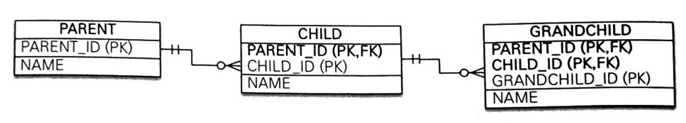

- ERD를 보면 자식 테이블은 부모 테이블의 기본 키를 포함해 복합키를 구성한다. 즉 식별자 클래스를 사용해야한다.


#### @IdClass

```java
@Entity
public class Parent {

    @Id
    @Column(name = "PARENT_ID")
    private Long id1;
  
    private String name;
}

@IdClass(ChildId.class)
@Entity
public class Child {

    @Id
    @ManyToOne
    @JoinColumn(name = "PARENT_ID")
    private Parent parent;

    @Id
    @Column(name = "CHILD_ID")
    private Long childId;
  
    private String name;
    
    
}

public class ChildId implements Serializable {

    private Long parent;   //Child.parent 매핑
    private Long childId;   //Child.childId 매핑

    public ChildIdId() {
    }

    public ChildIdId(Long parent, Long childId) {
        this.parent = parent;
        this.childId = childId;
    }
    //hashCode, equals
}
//손자
@Entity
@IdClass(GrandChildId.class)
public class GrandChild {

  @Id
  @ManyToOne
  @JoinColumns({
          @JoinColumn(name = "PARENT_ID"),
          @JoinColumn(name = "CHILD_ID"),
  })
  private Child child;

  @Id
  @Column(name = "GRANDCHILD_ID")
  private Long id;

  private String name;
}

public class GrandChildId implements Serializable {

  private ChildId child;   //GrandChild.child 매핑
  private Long id;   //GrandChild.id 매핑
  
  //hashCode, equals
}
```

#### @EmbeddedId

```java
@Entity
public class Parent {

    @Id
    @Column(name = "PARENT_ID")
    private Long id1;
  
    private String name;
}

@Entity
public class Child {

    @EmbeddedId
    private ChildId id;
    
    @MapsId("parentId") //ChildId.parentId 매핑
    @ManyToOne
    @JoinColumn(name = "PARENT_ID")
    private Parent parent;
  
    private String name;
}

@Embeddable
public class ChildId implements Serializable {

    private Long parentId;   //@MapsId("parentId")로 매핑

    @Column(name = "CHILD_ID")
    private Long childId;
    //hashCode, equals
}
//손자
@Entity
public class GrandChild {

    @EmbeddedId
    private GrandChildId id;

    @MapsId("childId")
    @ManyToOne
    @JoinColumns({
            @JoinColumn(name = "PARENT_ID"),
            @JoinColumn(name = "CHILD_ID"),
    })
    private Child child;

    private String name;
}

@Embeddable
public class GrandChildId implements Serializable {

    private ChildId childId;   //@MapsId("childId")로 매핑
  
    @Column(name = "GRANDCHILD_ID")
    private Long id;
    //hashCode, equals
}
```


### 3-4 복합키 식별 관계 -> 식별 관계로 변경

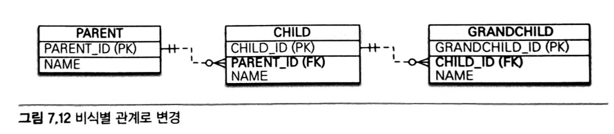

- 기존의 있던 복합키 + 식별 관계를 복합키가 없는 비식별 관계로 바꾸면 위의 테이블처럼 구성된다.
- 이렇게 되면 복합키가 없으므로 복합키 클래스를 만들지 않아도 되고, 매핑도 쉽고 코드도 단순해진다.


### 3-5 일대일 식별 관계

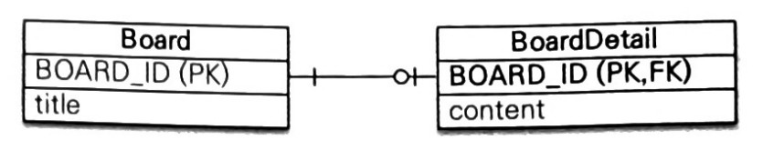

- 일대일 식별 관계는 자식 테이블의 기본 키값으로 부모 테이블의 기본 키값만 사용하는 것
- 부모 테이블 기본 키가 복합키가 아니라서, 자식 테이블의 기본 키는 복합키로 구성하지 않아도 된다.
```java
@Entity
public class Board {

    @Id
    @GeneratedValue(strategy = GenerationType.IDENTITY)
    @Column(name = "BOARD_ID")
    private Long id;

    private String title;

    // 일대일 식별 관계
    @OneToOne(mappedBy = "board")
    private BoardDetail boardDetail;
    
}

@Entity
public class BoardDetail {
  @Id
  private Long boardId;

  @Setter
  @MapsId //BoardDtail.boradId 매핑
  @OneToOne
  @JoinColumn(name = "BOARD_ID")
  private Board board;

  private String content;
}
```
- BoardDetail처럼 식별자가 단순히 하나의 컬럼이면 @MapsId를 사용하고 속성값은 비워두면 된다.
- @MapsId는 @Id를 사용해 식별자로 지정한 BoardDetail.boardId와 매핑됨


### 3-6 식별, 비식별 장단점
데이터베이스 설계 관점과 객체 관계 매핑의 관점에서 보면 비식별 관계를 선호한다.
- 식별 관계에서는 부모 테이블의 기본 키를 자식 테이블로 전파 -> 자식 테이블의 기본 키 컬럼이 점점 늘어남
- 식별 관계에서는 조인할 때 SQL 복잡하고 기본 키 인덱스가 불필요하게 커진다.
- 식별 관계에서는 2개 이상의 컬럼을 합해서 복합키를 만들어야하는 경우가 많다. -> 별도의 식별자 클래스를 만들어서 사용해야함
- 식별 관계에서는 기본 키로 자연키(비지니스 의미가 있는) 컬럼을 조합하는 경우가 많다. 자식, 손자까지 전파되면 변경하기 힘듬
- 식별 관계에서는 부모 테이블의 기본 키를 자식테이블의 기본 키로 사용해 테이블 구조가 유연하지 못한다.
- 비식별 관계에서는 기본 키로 주로 대리키를 사용하는데 JPA는 @GenerateValue 대리키 생성하는 편리한 방법 제공한다.


프로젝트 진행 시
- 비식별 관계를 사용하고
- 기본 키는 Long 타입, 대리키를 사용하는 것을 권장

## 4. 조인 테이블
데이터베이스 연관관계를 설계하는 방법

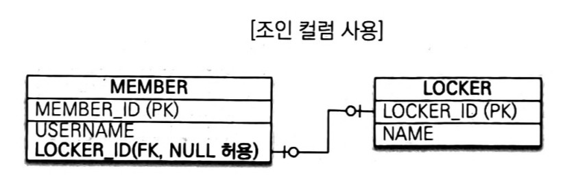

1. 조인 컬럼 사용(외래 키)
   - 외래 키 컬럼을 사용해 관리

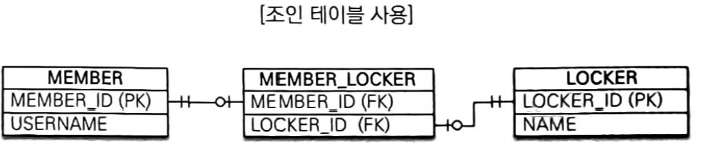

2. 조인 테이블 사용(테이블 사용)
   - 별도의 조인 테이블을 사용해 연관관계를 관리
   - 테이블 하나를 더 추가해야되서 부담이 된다(관리, 조인...)

기본으로 조인 컬럼을 사용하고 필요하다면 조인 테이블을 사용해라


### 4-1. 일대일 조인 테이블

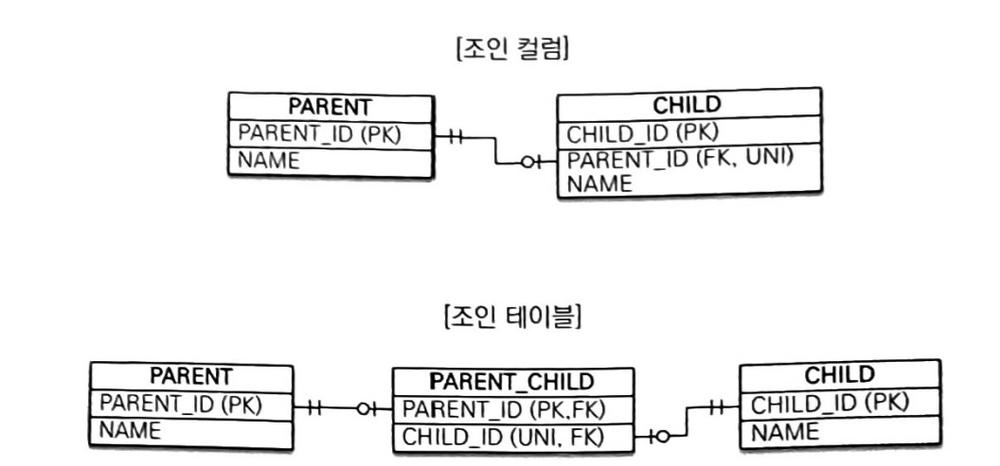


- 조인 테이블의 외래 키 컬럼에 각각에 총 2개의 유니크 제약조건을 걸어야함(PARENT_ID기본 키로 이미 유니크 제약조건이 걸어져 있다.)

```java
//부모
@Entity
public class Parent {
    @Id
    @GeneratedValue(strategy = GenerationType.IDENTITY)
    @Column(name = "PARENT_ID")
    private Long id;
  
    private String name;
  
    @OneToOne
    //@JoinTable 어노테이션 사용
    @JoinTable(name = "PARENT_CHILD",   //매핑할 조인 테이블 이름
            joinColumns = @JoinColumn(name = "PARENT_ID"),  //현제 참조하는 외래 키
            inverseJoinColumns = @JoinColumn(name = "CHILD_ID") //반대방향 엔티티를 참조하는 외래 키
    )
    private Child child;
}

//자식
@Entity
public class Child {

  @Id
  @GeneratedValue(strategy = GenerationType.IDENTITY)
  private Long id;
  private String name;


  //양방향시
  @OneToOne(mappedBy = "child")
  private Parent parent;
}

```


### 4-1. 일대다 조인 테이블

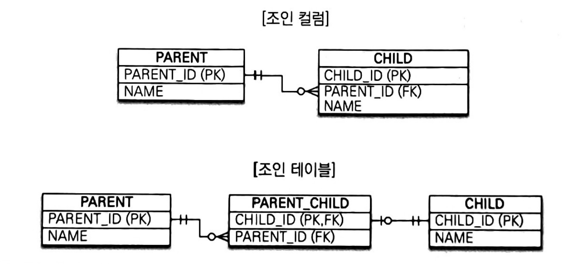

- N(다)와 관련된 컬럼인 CHILD_ID에 유니크 제약조건

```java
@Entity
public class Parent {

    @Id
    @GeneratedValue(strategy = GenerationType.IDENTITY)
    @Column(name = "PARENT_ID")
    private Long id;
    private String name;

    //다에 유니크 제약조건
    @OneToMany
    @JoinTable(name = "PARENT_CHILD",
        joinColumns = @JoinColumn(name = "PARENT_ID"),
        inverseJoinColumns = @JoinColumn(name = "CHILD_ID")
    )
    private List<Child> children = new ArrayList<>();
}

@Entity
public class Child {

  @Id
  @GeneratedValue(strategy = GenerationType.IDENTITY)
  @Column(name = "CHILD_ID")
  private Long id;

  private String name;
}
```

### 4-2. 다대일 조인 테이블
- 일대다에서 방향만 반대
- 일대다 양방향으로, 주인이 "다" 쪽으로 구현
```java
@Entity
public class Parent {

    @Id
    @GeneratedValue(strategy = GenerationType.IDENTITY)
    @Column(name = "PARENT_ID")
    private Long id;
    private String name;
    
    //다대일일 경우(일대다 양방향, 주인인 Child)
    @OneToMany(mappedBy = "parent")
    private List<Child> children = new ArrayList<>();
}

@Entity
public class Child {

    @Id
    @GeneratedValue(strategy = GenerationType.IDENTITY)
    @Column(name = "CHILD_ID")
    private Long id;
  
    private String name;

    //다대일 일경우 
    @ManyToOne(optional = false)
    @JoinTable(name = "PARENT_CHILD",
        joinColumns = @JoinColumn(name = "CHILD_ID"),
        inverseJoinColumns = @JoinColumn(name = "PARENT_ID")
    )
    private Parent parent;

}
```


### 4-3. 다대다 조인 테이블

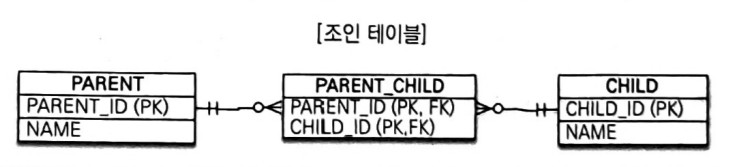

- 조인 테이블의 두 컬럼을 합해서 하나의 복합 유니크 제약조건을 검

```java
@Entity
public class Parent {

    @Id
    @GeneratedValue(strategy = GenerationType.IDENTITY)
    @Column(name = "PARENT_ID")
    private Long id;
    private String name;

    @ManyToMany
    @JoinTable(name = "PARENT_CHILD",
        joinColumns = @JoinColumn(name = "PARENT_ID"),
        inverseJoinColumns = @JoinColumn(name = "CHILD_ID")
    )
    private List<Child> children = new ArrayList<>();
}

@Entity
public class Child {

  @Id
  @GeneratedValue(strategy = GenerationType.IDENTITY)
  @Column(name = "CHILD_ID")
  private Long id;
  private String name;
}
```

## 5. 에티티 하나에 여러 테이블 매핑(@SecondaryTable)
- 한 엔티티에 여러 테이블을 매핑 할 수 있음

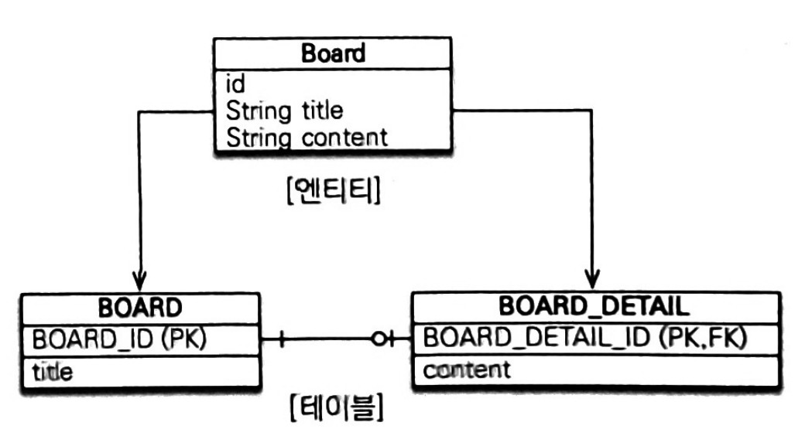

```java
@Entity
@Table(name = "BOARD")  //@Table사용해 BOARD 테이블과 매핑
@SecondaryTable(
    name = "BOARD_DETAIL",  //name 속성을 사용해 BOARD_DETAIL 테이블과 추가로 매핑
    pkJoinColumns = @PrimaryKeyJoinColumn(name = "BOARD_DETAIL_ID")
)
public class Board {

    @Id
    @GeneratedValue(strategy = GenerationType.IDENTITY)
    @Column(name = "BOARD_ID")
    private Long id;

    private String title;

    //@Column(table 을 사용해 BOARD_DETAIL 테이블의 컬럼에 매핑
    @Column(table = "BOARD_DETAIL")
    private String content;
}
```
- pkJoinColumns : 매핑할 다른 테이블의 기본 키 컬럼 속성


## 6. 실전 예제

### 요구사항 및 설계
다음 요구사항이 추가되었다.
- 상품의 종류는 음반, 도서, 영화가 있고 이후 더 확장될 수 있다.
- 모든 데이터는 등록일과 수정일이 있어야 한다.

요구사항에 대한 모델링

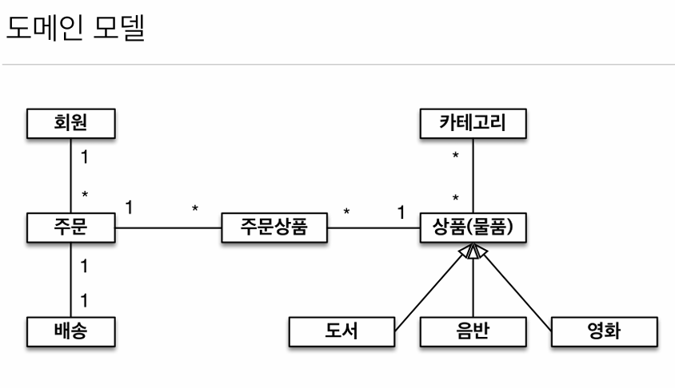

도메인 모델 상세 UML

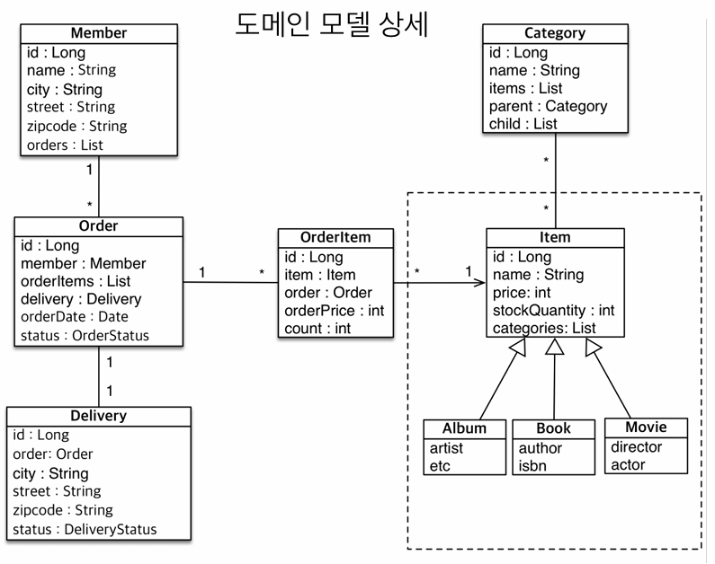


ERD

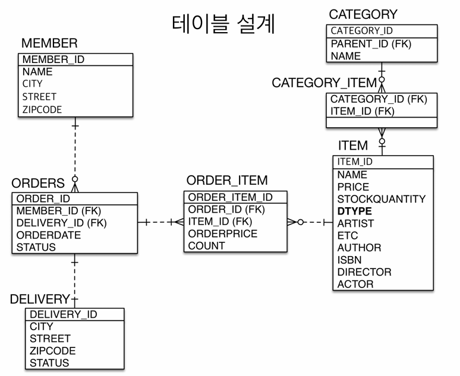

- 단일 테이블 전략 사용

### 구현 코드
1. 상품 상속 관계 매핑

```java

//1. 부모 클래스 Item을 abstract으로 변경
@Entity
//추가
@Inheritance(strategy = InheritanceType.SINGLE_TABLE)
@DiscriminatorColumn
public abstract class Item {
    //...
}


// 음반, 도서 영화 엔티티 추가
@Getter
@Setter
@Entity
public class Book extends Item{
  private String author;
  private String isbn;
}

@Getter
@Setter
@Entity
public class Album extends Item{
  private String artist;
  private String ect;
}
@Getter
@Setter
@Entity
public class Movie extends Item{
  private String director;
  private String actor;
}
```

2. 모든 데이터는 등록일과 수정일이 있어야 한다. -> @MappedSuperclass 사용
```java
// 등록일과 수정일이 있는 BaseEntity 구현
@Getter
@Setter
@MappedSuperclass
public abstract class BaseEntity {
    private String createdBy;
    private LocalDateTime createdDateTime;
    private String lastModifiedBy;
    private LocalDateTime lastModifiedDateTime;
}

// BaseEntity 전체 엔티티에 상속
@Entity
public class Category extends BaseEntity {
    //..
}
@Entity
public class Delivery extends BaseEntity {
    //.
}

@Entity
//...
public abstract class Item extends BaseEntity {
    //.
}

@Entity
public class Member extends BaseEntity {
    //..
}

@Entity
public class Order extends BaseEntity {
    //..
}
@Entity
public class OrderItem extends BaseEntity {
    //..
}

```
