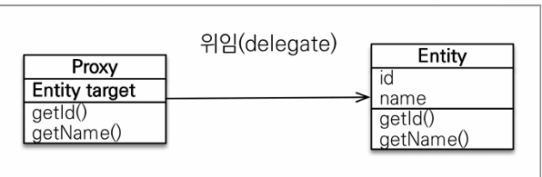
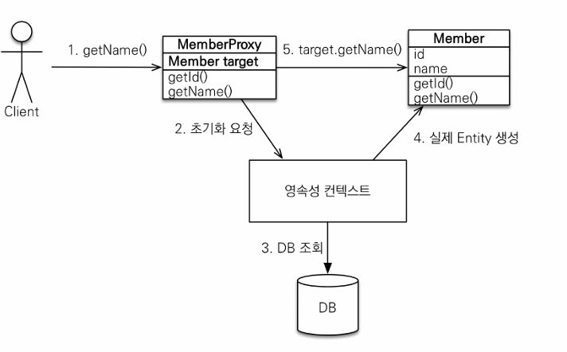
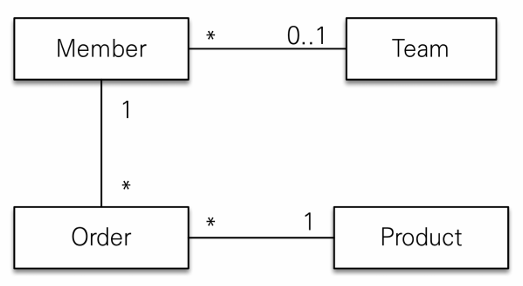
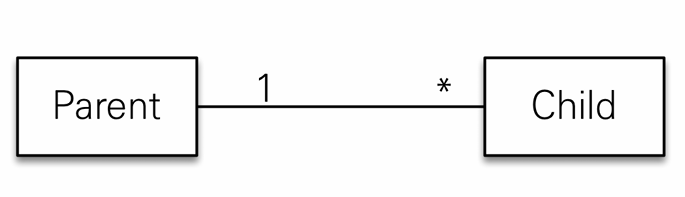

# 8장 프록시와 연관관계 관리
<!-- TOC -->
* [8장 프록시와 연관관계 관리](#8장-프록시와-연관관계-관리)
  * [1. 프록시](#1-프록시)
    * [1-1. 프록시 기초](#1-1-프록시-기초)
      * [프록시 초기화](#프록시-초기화)
      * [프록시 특징](#프록시-특징)
    * [1-2. 프록시와 식별자](#1-2-프록시와-식별자)
    * [1-3. 프록시 확인](#1-3-프록시-확인)
  * [2. 즉시 로딩과 지연 로딩](#2-즉시-로딩과-지연-로딩)
    * [2-1. 즉시 로딩](#2-1-즉시-로딩)
    * [2-2. 지연 로딩](#2-2-지연-로딩)
    * [2-3. 프록시와 즉시로딩 주의 점](#2-3-프록시와-즉시로딩-주의-점)
  * [3. 지연 로딩 활용](#3-지연-로딩-활용)
    * [3-1. 프록시와 컬랙션 래퍼](#3-1-프록시와-컬랙션-래퍼)
    * [3-2. JPA 기본 페치 전략](#3-2-jpa-기본-페치-전략)
  * [4. 영속성 전의: CASCADE](#4-영속성-전의-cascade)
    * [4-1. CASCADE 종류 및 저장과 삭제](#4-1-cascade-종류-및-저장과-삭제)
      * [CascadeType.PERSIST : 저장 예제](#cascadetypepersist--저장-예제)
      * [CascadeType.REMOVE : 삭제 예제](#cascadetyperemove--삭제-예제)
      * [cascade 사용시 주의점](#cascade-사용시-주의점)
  * [5. 고아 객체 제거](#5-고아-객체-제거)
  * [6. 영속성 전이 + 고아 객체, 생명 주기](#6-영속성-전이--고아-객체-생명-주기)
    * [cascade = CascadeType.ALL, orphanRemoval = true 를 같이 사용하면?](#cascade--cascadetypeall-orphanremoval--true-를-같이-사용하면)
<!-- TOC -->

## 1. 프록시
   
회원과 주문 엔티티가 1:N으로 연관관계를 가지고 있다고 하면, 회원을 조회할 때 마다 주문 엔티티가 필요하지 않는 경우가 많다.     
하지만 회원 엔티티와 주문 엔티티가 연관 관계를 맺고 있어, 회원 엔티티를 조회할 때 마다 주문 엔티티를 사용하지 않더라도 주문 엔티티까지 조인해서 가져온다.      
이런 방식은 **효율**적이지 않아 JPA는 이를 해결하려고 엔티티가 실제 사용될 떄까지 **데이터베이스 조회를 지연**하는 방법을 제공하고 이를 지연 로딩이라고 한다.     
지연 로딩할 수 있게 JPA에서는 가짜 객체 즉, 프록시 객체를 사용한다. 그래서 **프록시 객체**에 대해 먼저 알아보겠다.

### 1-1. 프록시 기초
**em.find()**
- 실제 엔티티를 조회

**em.getReference()**
- 데이터베이스 접근을 위임한 프록시 객체를 반환



- 실제 엔티티 클래스를 상속 받아 만들어져서 겉 모양이 같다.
- 프록시 객체는 실제 객체의 참조(target)를 보관한다.
- 객체의 메소드를 호출하게 되면 프록시 객체는 실제 객체의 메소드를 호출한다.

#### 프록시 초기화
프록시 객체을 이용해서 실제 필드값을 사용할 때(member.getName() 처럼) 객체의 메소드를 호출해서 실제 객체를 생성하는 것을 프록시 초기화라고 한다.



1. 프록시 객체를 통해 member.getName()을 호출해 실제 데이터를 조회하려고 함
2. 프록시 객체는 실제 엔티티가 생성되어 있으면 그 값을 반환하고, 그렇지 않으며 영속성 컨텍스트에 실제 엔티티 생성을 요청 한다.(초기화)
3. 영속성 컨텍스트는 데이터베이스를 조회해서 실제 엔티티 객체를 생성
4. 프록시 객체는 생성된 실제 엔티티 객체의 참조를 Member target 멤버 변수에 보관
5. 프록시 객체는 실제 엔티티 객체의 getName()를 호출해 결과를 반환

**프록시 클래스 예상 코드**

```java
class MemberProxy extends Member {

    Member target = null; // 실제 엔티티 참조
    
    public String getName() {
        if (target == null) {
            //2. 초기화 요청
            //3. DB 조회
            //4. 실제 엔티티 생성 및 참조 보관
            //this.target=...;
        }
        
        //5. target.getName();
        return target.getName();
    }
    //.....
}
```
#### 프록시 특징
- 프록시 객체는 처음 사용할 때 한 번만 초기화 한다.
- 프록시 객체를 초기화 할 때 프록시 객체가 실제 객체로 바뀌는 것이 아니라, 프록시 객체를 통해 실제 엔티티에 접근할 수 있는 것이다.
    ```java
    public void test() {
        Member findMember = em.getReference(Member.class, member1.getId());
        System.out.println("findMember.getClass() = " + findMember.getClass()); // ...Member$HibernateProxy$531IYe3E 프록시 객체 출력
        System.out.println(findMember.getName());   // 이시점에 db에 쿼리를 날림
    } 
   
    ```
- 프록시 객체는 원본 엔티티를 상속받은 객체라 타입 체크 시 주의(== 대신, instance of 사용)
    ```java
    public void test() {
        Member findM1 = em.find(Member.class, member1.getId());
        Member findM2 = em.find(Member.class, member2.getId());
        System.out.println((findM1.getClass() == findM2.getClass())); //true
  
        Member reference = em.getReference(Member.class, member1.getId());
        System.out.println((reference.getClass() == findM1.getClass())); //false
        
        System.out.println((referenceM1 instanceof Member));    // true, 타입 비교는 instance of
    } 
   
    ```
- 영속성 컨텍스트에 찾는 엔티티가 이미 있으면 데이터베이스를 조회할 필요 없어서 getReference()를 호출해도 프록시가 아닌 실제 엔티티 반환
    ```java
    public void test() {
        Member findMember = em.find(Member.class, member1.getId());
        System.out.println("findMember.getClass() = " + findMember.getClass());
        //class com.jpabook.ch08.domain.Member 출력
  
        Member referenceMember = em.getReference(Member.class, member1.getId());
        System.out.println("referenceMember.getClass() = " + referenceMember.getClass());
        //class com.jpabook.ch08.domain.Member 출력 -> 프록시 객체가 아닌 실제 엔티티를 반환함
    } 
   
    ```
- 준영속 상태일 떄(초기화는 영속성 컨텍스트의 도움을 받아야 가능), 프록시를 초기화하면 예외 발생(org.hibernate.LazyInitializationException)
    ```java
    public void test() {
        Member referenceMember = em.getReference(Member.class, member1.getId());
        em.detach(reference); // 또는 em.clear();로 준영속 상태로 만듬
        reference.getName();    // 프록시 객체 초기화
        //org.hibernate.LazyInitializationException 예외 발생 : Could not initialize proxy ....  no session....
    } 
   
    ```


### 1-2. 프록시와 식별자
- getReference로 조회할 때 식별자(PK)값을 파라미터로 전달 -> 프록시 객체는 해당 식별자 값을 보관함
- JPA는 @Access(AccessType.PROPERTY) 일 때, 프록시 객체는 식별자 값을 보관하기 때문에 식별자 값을 조회해도(예를 들어 team.getId()) 프록시를 초기화 하지 않음
- ~~반대로 @Access(AccessType.FIELD) 일 때, getId() 호출하면 프록시 객체를 초기화(메소드가 id만 조회하는 메소드인지 다른 필드까지 활용해서 어떤일을 하는 메소드인지 알지 못해서)~~
- jpa 3.0에서는 필드 타입을 때도 getId() 호출하면 프록시 객체를 초기화하지 않음(feat.chatgpt...?? 공식 문서를 못찾았어요.)
  > 원래 hibernate에서는 getId() 호출하면 프록시 객체를 초기화하지 않게 설정이 되었고, jpa 2.0 표준에서는 아니라서 이를 확인하는 설정이 
  > `hibernate.jpa.compliance.proxy`을 true 하는 거였는데 5.2 버전부터 Hibernate가 JPA 표준을 따르게 없데이트 되어서 해당 옵션이 없어졌음      
  > 그럼 지금 jpa 표준을 딸서 getId() 호출하면 프록시 객체를 초기화하지 않는 다는 이야기일까요...?? gpt는 그렇다고 하는데....공식 문서나 블로그 같은데어서 못찾아서... 일단 나중에 알아보는 것으로...
- 연관관계를 설정할 때, 엔티티 접근 방식을 필드로 설정해도 프록시를 초기화 하지 않음

### 1-3. 프록시 확인
- persistenceUtil.isLoaded(Object entity) 메서드를 사용하면 인스턴스 초기화 여부 확인 가능
- 초기화 되지 않은 인스턴스는 false
- 초기화 되었거나 프록시 인스턴스(진짜 엔티티)가 아니면 true를 반환
- 프록시를 강제 초기화를 하고 싶으면 하이버네이트의 initialize() 메소드 호출


## 2. 즉시 로딩과 지연 로딩
### 2-1. 즉시 로딩
- 엔티티를 조회할 때 연관된 엔티티도 같이 함께 조회하는 방법
- 연관관계 매핑 어노테이션의 fetch 속성 값을 FetchTyp.EAGER로 지정한다.
- @ManyToOne, @OneToOne는 default값이 FetchTyp.EAGER이다.
- 사용 법 : `@ManyToOne(fetch = FetchType.EAGER)`
```java
public class Member {
    //..
  
    @ManyToOne(fetch = FetchType.EAGER) // fetch 설정 안해도 default로 EAGER임
    @JoinColumn(name = "TEAM_ID")
    private Team team;
    
    //..
}
```
- 위의 예제처럼 설정하면 member를 조회 시 team 엔티티디 같이 조인(left outer join)

> #### 참고: null 제약 조건과 join 전략
> 즉시 로딩 시 left outer join을 사용함 : jpa 기본 전략     
> 외래키가 null 값을 허용하는데 inner 조인을 하면 데이터를 조회할 수 없음(ex. 팀에 소속되지 않은 회원과 팀을 inner 조인하면 팀과 회원 데이터를 조회할 수 없음)     
> 하지만 내부 조인이 성능 최적화에 더 유리한데, 만갹 외래키에 not null 제약 조건을 설정하면 내부 조인만 사용해도 됨     
> ```java
>   @ManyToOne
>   @JoinColumn(name = "TEAM_ID", nullable = false) // not null 제약 조건
>   private Team team;
> ```
> 위에처럼 null 값을 허용하지 않는다고 하면 jpa는 내부 조인을 사용     
> 또는 `@ManyToOne.optional = false`로 설정해도 내부 조인 사용     

### 2-2. 지연 로딩
- 프록시 객체를 사용해서 연관된 엔티티를 실제 사용할 때 조회함
- 연관관계 매핑 어노테이션의 fetch 속성 값을 FetchTyp.LAZY로 지정한다.
- @ManyToMany, @OneToMany default값이 FetchTyp.LAZY 이다.(many 쪽이 컬랙션이므로)
- 사용 법 : `@ManyToOne(fetch = FetchType.LAZY)`
```java
public class Member {
    //..
  
    @ManyToOne(fetch = FetchType.LAZY)
    @JoinColumn(name = "TEAM_ID")
    private Team team;
    
    //..
}

public void test() {
    //...
    
    Member findMember = em.find(Member.class, member1.getId());
    // member만 조회하는 select 쿼리 나감

    System.out.println("팀조회 : " + findMember.getTeam().getClass());
    // 팀조회 : class com.jpabook.ch08.domain.Team$HibernateProxy$uwr2HGFd -> 프록시 객체로 가져옴

    // 실제 team을 사용하는 시점에 초기화
    findMember.getTeam().getName(); // -> 이때 team 조회하는 쿼리 발생
}
```

### 2-3. 프록시와 즉시로딩 주의 점
- 가급적 지연 로딩만 사용할 것(특히 실무에서)
- 즉시 로딩을 적용하면 예상하지 못한 SQL이 발생한다.
  - JPQL에서 N+1 문제를 이르킴
    - 연관된 엔티티의 쿼리가 여러번 나감(전체 멤버를 조회 했는데 팀이 여러개면 그 팀 갯수만큼 select 쿼리가 발생하는 것을 볼 수 있음)
- @ManyToOne, @OneToOne은 lazy로 변경하고
- @OneToMany, @ManyToMany는 기본이 lazy이다.


## 3. 지연 로딩 활용
사내 주문 관리 시스템의 클래스 모델이 아래와 같다.



- member랑 team (N:1 관계) :  자주 함께 사용 -> 즉시 로딩
- member랑 Order (1:N 관계) : 가끔 사용 -> 지연 로딩
- Order랑 Product (N:1 관계) : 자주 함께 사용 -> 즉시 로딩

```java
@Entity
public class Member {

    @Id
    @GeneratedValue(strategy = GenerationType.IDENTITY)
    private Long id;

    private String name;
    
    @ManyToOne(fetch = FetchType.EAGER)
    @JoinColumn(name = "TEAM_ID", nullable = false)
    private Team team;


    @OneToMany(mappedBy = "member", fetch = FetchType.LAZY)
    private List<Order> orders = new ArrayList<>();

    //...

    public void addOrder(Order order) {
        order.setMember(this);
    }
}

@Entity
public class Team {
    @Id
    @GeneratedValue(strategy = GenerationType.IDENTITY)
    private Long id;
    private String name;
    
    //...
}

@Entity
public class Product {
    @Id
    @GeneratedValue(strategy = GenerationType.IDENTITY)
    private Long id;
  
    private String name;
    
    //...
}
@Entity
@Table(name = "ORDERS")
public class Order {
    //...
  
    @ManyToOne(fetch = FetchType.LAZY)
    @JoinColumn(name = "MEMBER_ID")
    private Member member;
  
    @ManyToOne
    @JoinColumn(name = "PRODUCT_ID")
    private Product product;
    
    //..
  
    public void addProduct(Product product) {
      this.product = product;
    }
  
    public void setMember(Member member) {
      if (this.member != null) {
        this.member.getOrders().remove(this);
      }
      this.member = member;
      this.member.getOrders().add(this);
    }
}
```
- 위에 처럼 설정하면 member 조회 시 team을 같이 가져오고 orders는 지연로딩이라서 orders를 사용하는 시점에서 가져온다.
- orders.get(index) 호출하는 시점에서 select 쿼리 나감
- orders.get(index)를 가져올 때 product는 즉시 로딩이라서 바로 가져온다.

### 3-1. 프록시와 컬랙션 래퍼
- 컬랙션 래퍼 : 엔티티에 컬랙션이 있으면 컬렉션을 추적할 목적으로 원본 컬랙션을 내장 컬랙션(하이버네이트가 제공)으로 변경
```java
List<Order> orders = findMember.getOrders();
System.out.println("orders.getClass().getName() = " + orders.getClass());
// 결과 : org.hibernate.collection.spi.PersistentBag -> 컬랙션 래퍼 반환
```
- 엔티티를 지연 로딩하면 프록시 객체를 사용해서 지연 로딩을 수행
- 컬랙션은 지연 로딩하면 컬랙션 래퍼가 지연 로딩을 처리(프록시의 역활을 수행)
- orders.get(0); 처럼 실제 데이터를 조회할 때 초기화함

### 3-2. JPA 기본 페치 전략
- 모든 연관 관계에 지연 로딩를 사용
- 실무에서 즉시 로딩을 사용하지 않기!!


## 4. 영속성 전의: CASCADE
- 특정 엔티티를 영속 상태로 만들 때 연관 엔티티도 함께 영속 상태로 만들고 싶으면(em.persist(member) 시 team도 같이 영속상태로 만들려면) 영속성 전이 기능을 사용
- JPA CASCADE 옵션 사용


### 4-1. CASCADE 종류 및 저장과 삭제

```java
public enum CascadeType {
    ALL,        // 모두 적용
    PERSIST,    // 영속
    MERGE,      // 병합
    REMOVE,     // 삭제
    REFRESH,    //REFRESH
    DETACH      //DETACH
}
```
#### CascadeType.PERSIST : 저장 예제



- 영속 전이를 활성화 하는 PERSIST을 사용해서 저장해 보자.

```java
@Entity
public class Parent {
    // ...
  
    @OneToMany(mappedBy = "parent", cascade = CascadeType.PERSIST)
    private List<Child> children = new ArrayList<>();
    
    public void addChild(Child child) {
        children.add(child);
        child.setParent(this);
    }
}

public void test() {

    // 만약 영속 전이를 활성화하지 않았을때 저장
    parent.addChild(child1);
    parent.addChild(child2);
    
    em.persist(parent);
    em.persist(child1);
    em.persist(child2);

    //영속 전이를 활성화할 경우
    parent.addChild(child1);
    parent.addChild(child2);
    em.persist(parent); //parent, child1, child2에 대한 insert 퀄리가 나감
  
}
```

#### CascadeType.REMOVE : 삭제 예제

```java
@Entity
public class Parent {
    // ...
  
    @OneToMany(mappedBy = "parent", cascade = CascadeType.REMOVE)
    private List<Child> children = new ArrayList<>();
    
    public void addChild(Child child) {
        children.add(child);
        child.setParent(this);
    }
}

public void test() {

    // 만약 영속 전이를 활성화하지 않았을때 삭제
    Parent parent = em.find(Parent.class, parentId);
    Child child1 = em.find(Child.class, child1);
    Child child2 = em.find(Child.class, child2);
    
    em.remove(parent);
    em.remove(child1);
    em.remove(child2);

    //영속 전이를 활성화할 경우
    Parent parent = em.find(Parent.class, parentId);
    em.remove(parent); //parent, child1, child2에 대한 delete 퀄리가 나감(3번의 delete 쿼리)
  
}
```

#### cascade 사용 시 주의점
- 영속성 전이는 연관관계를 매핑하는 것과 아무 관련이 없다.
- 엔티티를 영속화 할 때 연관된 엔티티도 함께 영속화하는 편리함을 제공하는 것일 뿐이다.
- 하나의 부모가 자식들을 관리할 떄 만 사용해라(자식이 다른 곳에서 사용 안될 때, 즉 소유자가 부모 하나일 때) == 단일 엔티티에 완전히 종속적일 때 사용
- 자식들이 다른 애들이랑 연관 관계가 있을 경우 사용하면 안된다. 

## 5. 고아 객체 제거
- 끊어진 자식 엔티티를 자동으로 삭제하는 기능
- 부모 엔티티의 컬렉션에서 자식 엔티티의 참조만 제거하면 자식 엔티티가 자동으로 제거된다.
- 사용법 : orphanRemoval = true로 설정한다.

```java
@Entity
public class Parent {
    //...
    
    @OneToMany(mappedBy = "parent", orphanRemoval = true)
    private List<Child> children = new ArrayList<>();
    
    //...

}

public void test() {
    //..
  
    Parent parent = em.find(Parent.class, id);
    parent.getChildren().remove(0); // 자식 엔티티를 컬랙션에서 제거
    // DELETE FROM CHILD WHERE =...
}
```
- orphanRemoval = true로 설정하고 자식 엔티타를 부모엔티티와 연관관계를 끊어주면 알아서 자식 엔티티의 delete 쿼리가 나간다.
- `em.remove(parent)`를 해도 자식들이 제거 된다. 
- 주의할 점
  - cascade 처럼 참조하는 곳이 하나일 때 사용해야 한다.
  - 위와 같은 이유로 해당 옵션은 @OneToOne, @OneToMany에서만 사용할 수 있다.

## 6. 영속성 전이 + 고아 객체, 생명 주기
### cascade = CascadeType.ALL, orphanRemoval = true 를 같이 사용하면?
- 엔티티는 스스로 생명 주기를 관리함(em.persist() 영속, em.remove()로 제거)
- 두 옵션을 다 활성화하면 부모 엔티티를 통해서 자식의 생명주기를 관리 할 수 있음
  - `parent.addChild(child)` : 영속
  - `parent.getChildren().remove(removeChild)` : 제거


