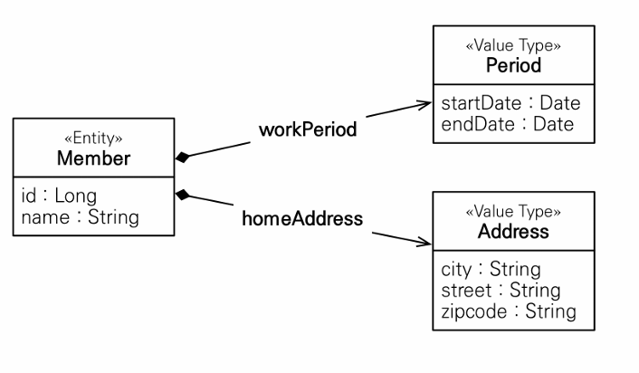
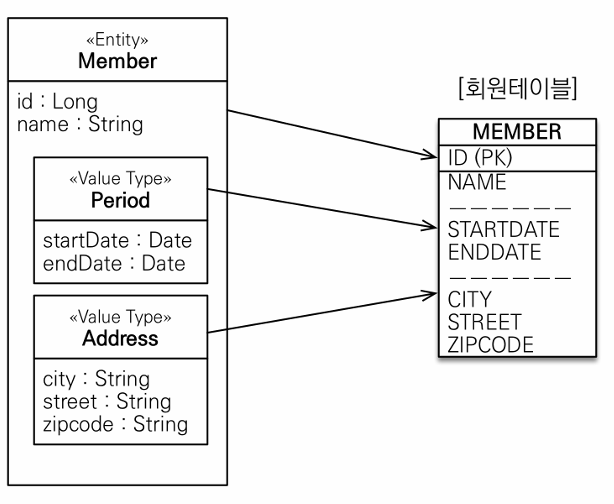
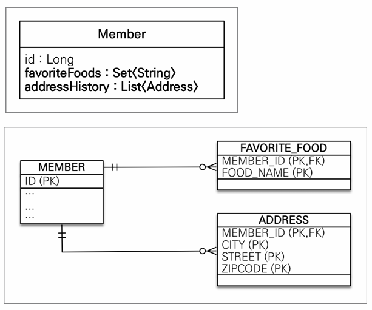

# ch09. 값 타입

<!-- TOC -->
* [ch09. 값 타입](#ch09-값-타입)
  * [1. 기본값 타입](#1-기본값-타입)
  * [2. 임베디드 타입(복합 값 타입)](#2-임베디드-타입복합-값-타입)
    * [2-1. 임베디드 타입과 테이블 매핑](#2-1-임베디드-타입과-테이블-매핑)
    * [2-2. 임베디드 타입과 연관관계](#2-2-임베디드-타입과-연관관계)
    * [2-3. @AttributeOverride: 속성 재정의](#2-3-attributeoverride-속성-재정의)
  * [3. 값 타입과 불변 객체](#3-값-타입과-불변-객체)
    * [3-1. 값 타입 공유 참조](#3-1-값-타입-공유-참조)
    * [3-2. 값 타입 복사](#3-2-값-타입-복사)
    * [3-3. 불변 객체](#3-3-불변-객체)
  * [4. 값 타입의 비교](#4-값-타입의-비교)
  * [5. 값 타입 컬렉션](#5-값-타입-컬렉션)
    * [5-1. 값 타입 컬렉션 사용](#5-1-값-타입-컬렉션-사용)
      * [저장](#저장)
      * [조회](#조회)
      * [수정](#수정)
    * [5-2. 값 타입 컬렉션의 제약사약](#5-2-값-타입-컬렉션의-제약사약)
  * [6. 정리](#6-정리)
      * [1. 엔티티 타입](#1-엔티티-타입)
      * [1. 값 타입](#1-값-타입)
<!-- TOC -->

----

- JPA 데이터 타입
  - 엔티티 타입 
    - 식별자를 통해 지속해서 추적 가능
  - 값 타입
    - 속성만 있으므로 추적할 수 없음
    - 단순한 수치 정보

- 값타입
  - 기본 타입(basic value type)
    - 자바 기본 타입(int, double..)
    - 래퍼 클래스(Integer...)
    - String
  - 임베디드 타입(복합 값 타입)
  - 컬렉션 값 타입

## 1. 기본값 타입
```java
@Entity
class Member {
    @Id
    private Long id;
    private String name;
    private int age;
}
```
- Member는 엔티티 타입
- name, age가 값 타입
  - 위의 속성들은 식별자 값 없음
  - 생명주기도 Member(엔티티)에 의존함
- 값타입은 공유하면 안됨

## 2. 임베디드 타입(복합 값 타입)
- 임베디드 타입(embedded type) : 새로운 값 타입을 직접 정의
- 예를 들어 주소를표현하는 타입을 만들고 싶음(city, street, zipcode 값을 멤버 말고도 여러 곳에서 사용한다면)
- 임베디드 타입을 사용하면 좀 더 객체 지향적으로 사용할 수 있음

```java

@Entity
class Member {

    @Id
    private Long id;
    private String name;

    @Embedded
    private Period workPeriod;  //근무 기간

    @Embedded
    private Address homeAddress; //집 주소
}

//@Setter // 임베디드 타입은 불변 객체로 만들어야함(그래서 setter를 private으로 만들거나, 만들지 말아야함)
@Embeddable
public class Address {

    @Column(name = "CITY")  // 매핑할컬럼을정의 가능
    private String city;
    private String street;
    private String zipcode;
}

@Embeddable
public class Period {

    private LocalDateTime startDate;
    private LocalDateTime endDate;

    public boolean isWork(LocalDateTime dateTime) {
        //... 값 타입을 위한 베소들르 정의 할 수 있음
    }
}
```
- 위에처럼 구성하면 회원 엔티티가 더욱 의미 있고 응집력 있게 변한 것을 알 수 있음
- 새로 정의한 값 타입들은 재사용 할 수 있고, 응집도도 아주 높음
- @Embeddable : 값 타입을 정의하는 곳에 표시
- @Embedded : 값 타입을 사용하는 곳에 표시(생략 가능)
- 임베디드 타입은 기본 생성자가 필수
- 임베디드 타입의 생명주기는 엔티티의 생명주기에 의존 -> 엔티티와 임베디드 타입 관계는 UML로 표현하면 컴보지션(하이버네이트에서는 컴포넌트) 관계가 됨(아래 그림 참고)



### 2-1. 임베디드 타입과 테이블 매핑
- 임베디드 타입은 엔티티 값일 뿐이다.
- 임베디드 타입은 속한 엔티티 테이블에 매핑 된다.



- 임베디드 타입 덕분에 객체와 테이블을 아주 세밀하게 매핑하는 것이 가능
- 잘 설계한 ORM 애플리케이션은 매핑한 테이블 수 보다 클래수 수가 더 많음

### 2-2. 임베디드 타입과 연관관계
- 임베디드 타입은 값 타입을 포함하거나 엔티티를 참조 할 수 있다.
```java
@Embeddable
public class Zipcode {
    String zip;
    String plusFour;

    public Zipcode(String zip, String plusFour) {
        this.zip = zip;
        this.plusFour = plusFour;
    }
}

@Embeddable
public class Address {

    private String city;
    private String street;
    @Embedded
    private Zipcode zipcode;    //임베디드 타입 포함


    public Address(String city, String street, String zipcode) {
        this.city = city;
        this.street = street;
        this.zipcode = new Zipcode(zipcode, "0000");
    }
}

@Embeddable
public class PhoneNumber {
    String areaCode;
    String localNumber;
    @ManyToOne
    PhoneServiceProvider provider;  // 엔티티 참조
}

@Entity
public class PhoneServiceProvider {
    @Id @GeneratedValue(strategy = GenerationType.IDENTITY)
    private Long id;
    String name;
}

```
- 값 타입인 Address가 값 타입인 Zipcode를 포함할 수 있음
- 값 타입인 PhoneNumber가 엔티티 타입인 PhoneServiceProvider를 참조할 수 있음

### 2-3. @AttributeOverride: 속성 재정의
- 예를 들어 회원에게 주소가 하나 더 필요하다면 @AttributeOverride로 재정의하면 된다. 즉, 임베디드 타입에 정의한 매핑정보를 재정의 할 수 있다.
```java
@Entity
class Member {

    @Id
    private Long id;
    private String name;

    @Embedded
    private Period workPeriod;  //근무 기간

    @Embedded
    private Address homeAddress; //집 주소

    @Embedded
    @AttributeOverrides({
        @AttributeOverride(name = "city", column = @Column(name = "COMPANY_CITY")),
        @AttributeOverride(name = "zipcode", column = @Column(name = "COMPANY_ZIPCODE")),
        @AttributeOverride(name = "street", column = @Column(name = "COMPANY_STREET"))
    })
    private Address companyAddress; //집 주소
}
```


## 3. 값 타입과 불변 객체
값 타입은 단순하고 안전하게 다룰 수 있어야한다.
### 3-1. 값 타입 공유 참조
```java
member1.setHomeAddress(new Address("Old city"));
Address address = member1.getHomeAddress();

address.setCity("new City");    //회원1의 address 값을 공유해서 사용
member2.setHomeAddress(address);
```
- member2의 주소의 city만 "new City"로 변경하길 기대했지만, member1의 city도 "new City"로 변경되버린다.
- 같은 값 타입을 여러 엔티티에서 공유하게 되면 위와 같은 사항이 벌어진다.(side effect)
- 이런 공유 참조로 인해 발생하는 버그는 정말 찾아내기 어렵다.
- 이런 부작용을 막으려면 값을 복사해서 사용하면 된다.

### 3-2. 값 타입 복사
- 값 타입의 실제 인스턴스인 값을 공유하는 것은 위험해 대신에 값을 복사해서 사용해야한다.
```java
member1.setHomeAddress(new Address("Old city"));
//회원1의 address값을 복사해서 새로운 값을 생성
Address address = member1.getHomeAddress().clone();

address.setCity("new City");
member2.setHomeAddress(address);
```
- 위에처럼 구성한면 의도한 대로 member1의 주소에는 "Old city"그대로 이고, member2의 주소에는 "new City"로 변한다. 
- 이처럼 값을 복사해서 사용하면 공유 참조로 인해 발생하는 부작용을 피할 수 있다.
- 문제는 복사하지 않고 원본의 참조 값을 직접 넘기는 것을 막을 방법이 없다. 즉 객체의 공유 참조는 피할 수 없다.
- 근본적인 해결 챌은 객체의 값을 수정하지 못하게 막으면 된다.(setter를 모두 제거하기)

### 3-3. 불변 객체
- 값 타입은 부작용 걱정 없이 사용할 수 있어야한다.
- 객체를 불변하게 만들려면 값을 수정할 수 없으므로 부작용을 원천 차단 할 수 있다.
- 값 타입은 불변 객체로 설계해야하 한다.

불변 객체로 만들기
```java
@ToString
@Getter
@Embeddable
public class Address {

    private String city;
    private String street;
    @Embedded
    private Zipcode zipcode;    //임베디드 타입 포함

    
    public Address(String city, String street, String zipcode) {
        this.city = city;
        this.street = street;
        this.zipcode = new Zipcode(zipcode, "0000");
    }

    //기본 생성자는 필수
    public Address() {
    }
    
    //setter(수정자)는 새엉하지 않는다.
}

public void test() {
    //..
    Address address = member1.getHomeAddress();
    
    //회원 1의 주소를 수정하고 싶으면, 
    // 새로운 객체를 생성해서 사용해야함(자바의 Integer, String은 자바의 대표적인 불변 객체)
    Address newAddress = new Address("new city", address.getStreet(), address.getZipCode);
}

```

## 4. 값 타입의 비교
자바가 제공하는 객체 비교는 2가지
- 동일성(Identity) 비교 : 인스턴스 참조 값을 비교 (==)
- 동등성(Equivalence) 비교 : 인스턴스의 값을 비교, equals() 사용

값 타입을 비교할 때는 equals를 사용해서 동둥성 비교를 해야한다. 그래서 equals() 메소드를 재정의해야 한다.(hashCode()도 재정의하는 것이 안전하다. 그렇지 않으면 컬렉션이 정상 작동 안함)     
equals, hashCode 재정의 할때는 자바 IDE에서 대부분 자동으로 생성해주는 기능이 있다.(대로록 자동으로 사용하다.)


## 5. 값 타입 컬렉션
- 값 타입을 하나 이상 저장하려면 컬렉션에 보관하고 @ElementCollection과 @CollectionTable 어노테이션을 사용하면 된다.
```java
@Entity
public class Member {
    //...
    //컬랙션 fetch = FetchType.LAZY 기본 값이 레이지
    @ElementCollection(fetch = FetchType.LAZY)
    @CollectionTable(name = "FAVORITE_FOOD",
        joinColumns = @JoinColumn(name = "MEMBER_ID")
    )
    @Column(name = "FOOD_NAME")
    private Set<String> favoriteFood = new HashSet<>();

    @ElementCollection
    @CollectionTable(name = "ADDRESS_HISTORY",
        joinColumns = @JoinColumn(name = "MEMBER_ID")
    )
    private List<Address> addressHistory = new ArrayList<>();
    
    //...
}
```



favoriteFood
- favoriteFood는 기본값 타입인 String을 컬렉션을 가지는데 이것을 데이터베이스 테이블로 매핑해야한다.
- 그래서 별도의 테이블을 추가하고 @CollectionTable를 사용해서 추가한 테이블을 매핑하면 된다.
- favoriteFood 처럼 사용되는 컬럼이 하나면 @Column어노테이션을 사용해 컬럼명을 지정할 수 있다.

addressHistory
- 임베디드 타입인 Address를 컬렉션으로 가진다.
- 이것도 별도의 테이블을 사용해야한다.
- 매핑 정보는 @AttributeOverrides로 재정의할 수 있다.

### 5-1. 값 타입 컬렉션 사용
#### 저장
```java
public void test() {
    //임베디드 값 타입
    member.setHomeAddress(new Address("city", "street", "zipcode"));
    
    //기본값 타입 컬렉션
    member.getFavoriteFoods().add("짬뽕");
    member.getFavoriteFoods().add("짜장");
    member.getFavoriteFoods().add("탕수육");
    
    //임베디드 값 타입 컬렉션
    member.getAddresHistory().add(new Address("서울", "강남", "123-123"));
    member.getAddresHistory().add(new Address("서울", "강북", "000-000"));
    
    //저장시 member만 저장
    em.persist(member);
}
```
- member 엔티티만 영속화 하면 엔티티의 값 타입도 함께 영속화 되고 저장 됨
- 값 타입 컬렉션은 영속성 전이(Cascade) + 고아 객체 제거(orphan remove) 기능을 필수로 가진다.
- 실제 실행되는 쿼리는 다음과 같다.
  - member INSERT 1번(member, homeAddress)
  - member.favoriteFoods INSERT 3번
  - member.addressHistory INSERT 2번

#### 조회
- 값 타입 컬렉션은 조회할 때 페치 전략이 기본의 LAZY이다.
- 조회 시 지연 로딩된다.

#### 수정
```java
public void test() {
    //....
    Member member = em.find(Member.class, id);
    
    //1. 임베디드 값 타입 수정
    member.setHomeAddress(new Address("new city", "new street", "new zipcode"));
    
    //2. 기본값 타입 컬렉션 수정
    Set<String> favoriteFoods = member.getFavoriteFoods();
    member.getFavoriteFoods().remoe("짬뽕");
    member.getFavoriteFoods().add("치킨");
    
    //3. 임베디드 값 타입 컬렉션 수정
    List<Adress> addressHistory = member.getAddresshistroy();
    addressHistory.remove(new Address("서울", "강남", "123-123"));
    member.getAddresHistory().add(new Address("새도시", "새주소", "123-456"));
    
}
```
1. 임베디드 값 타입 수정 : member table만 update sql
2. 기본값 타입 컬렉션 수정 : "짬뽕"을 delete sql, "치킨" insert
3. 임베디드 값 타입 컬렉션 수정
   - 전체 MEMBER_ID에 해당하는 값 delete
   - 이전 데이터 + 바뀐 데이터 insert

### 5-2. 값 타입 컬렉션의 제약사약
- 엔티티는 식별자가 있어서 값을 변경해도 식별자로 데이터베이스에 저장된 원본 데이터를 쉽게 찾아서 수정할 수 있음
- 값 타입은 식별자라는 개념이 없어서(단순 값들의 모임이라) 값을 변경해보면 데이터베이스에 저장된 원본 데이터를 찾기 어렵다.
- 그래서 값 타입은 변경하면 매핑된 테이블의 연관된 모든 데이터를 삭제하고 현재 값 타입 컬랙션 객체에 있는 모든 값을 데이터베이스에 다시 저장한다.(5-1. 값 타입 컬렉션 사용-수정-3.임베디드 값 타입 컬렉션 수정 참조)
- 실무에서는 값 타입 컬렉션이 매핑된 테이블에 데이터가 많다면 값 타입 컬렉션 대신 일대다 관계를 고려해야한다.
- 그래서 일대다 관계로 설정하고 영속성 전의(Cascade) + 고아 객체 제거 기능을 적용하면 값 타입 컬렉션 처럼 사용할 수 있다.
```java
@Entity
class AddressEntity {
    //..
    @Embedded
    private Address address;
    
    //..
}
@Entity
class Member {
    //..
    @OneToMany(cascade = CascadeType.ALL, orphanRemoval = true)
    @JoinColumn(name = "MEMBER_ID")
    private List<AddressEntity> addressEntityList = new ArrayList<>();

    //..
}
```

## 6. 정리
JPA 데이터 타입
1. 엔티티 타입
2. 값 타입

#### 1. 엔티티 타입
- 식별자가(@Id)가 있음
- 생명주기가 있음
- em.persist(entity)로 영속화하고 em.remove(entity)로 제거한다.
- 공유할 수 있다.

#### 1. 값 타입
- 식별자가 없다.
- 생명주기를 엔티티에 의존한다.
- 공유하지 않는 것이 안전하다.
  - 값을 복사해서 사용해야한다.
  - 오직 하나의 주인만이 관리해야 한다.
  - 불변객체로 만드는 것이 안전하다.
